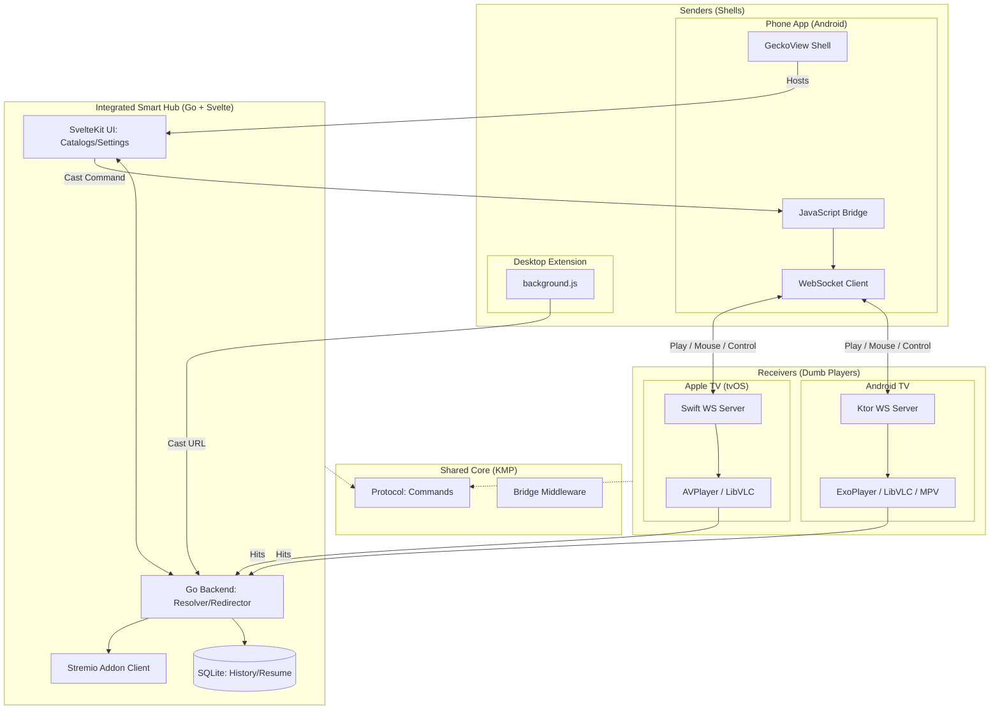

# PlayBridge Architecture Review & Open-Source Recommendations

This document provides a comprehensive architecture review of the PlayBridge project and actionable recommendations before open-sourcing.

---

## Project Overview

**PlayBridge** is a multi-platform casting suite enabling Android phones and desktop browsers to send video URLs and control commands to TV receivers. The project leverages Kotlin Multiplatform (KMP) for shared logic across platforms.

| Module | Path | Role |
| :--- | :--- | :--- |
| **Phone (Sender)** | `phone/` | Android shell with GeckoView; hosts the Hub UI |
| **Integrated Hub** | `hub/` | Unified Logic Hub (Go Backend + Svelte UI) for catalogs & resolution |
| **TV (Android)** | `tv/player/` | Android TV receiver (Dumb player: ExoPlayer/MPV/VLC) |
| **TV Browser** | `tv/browser/` | Android TV standalone browser |
| **TV (Apple)** | `tv/apple-tv/` | Native tvOS receiver (Dumb player: AVPlayer/VLC) |
| **Shared (Core)** | `shared/` | KMP library: Protocol and cross-platform bridge logic |
| **Extension** | `extension/` | Desktop Firefox extension; interfaces with the Hub |

---

## Architecture Diagram



---

## Project Structure

```
PlayBridge/
├── phone/               # Android Shell (Phone)
├── hub/                 # Integrated Smart Hub (Go + Svelte)
├── tv/
│   ├── player/          # Android TV Player App (Receiver)
│   ├── browser/         # Android TV Browser App (Standalone)
│   └── apple-tv/        # Native Apple TV (tvOS) App
├── shared/              # Kotlin Multiplatform Core (Protocol/Logic)
├── extension/           # Firefox Desktop Extension
├── scripts/             # Maintenance & automation scripts
├── libs/                # Local libraries (mpv-android, etc.)
└── docs/                # Project documentation
```

---

## Hub Architecture
👉 [Integrated Smart Hub Architecture](hub/README.md)

---

## Phone App Architecture
👉 [Phone App Architecture](phone/ARCHITECTURE.md)

---

## TV App Architecture
👉 [Android TV Architecture](tv/ARCHITECTURE.md)
👉 [Apple TV Architecture](tv/apple-tv/ARCHITECTURE.md)

---

## Shared Module Architecture
👉 [Shared Architecture](shared/ARCHITECTURE.md)

---

## Standalone Browser Extension
👉 [Extension Architecture](extension/ARCHITECTURE.md)

---

## Issues & Refactoring Recommendations

### 🔴 Critical Issues (Play Store Blockers)
(None currently identified)

### 🟡 Moderate Issues

#### 5. Missing Error Handling in Extensions
- Browser extension silently catches errors in `background.js`
- **Recommendation**: Add proper error logging/reporting

### 🟢 Minor Improvements

#### 6. Components.kt is Not True DI
- Uses lazy singletons, not proper dependency injection
- **Recommendation**: Consider Hilt/Koin for testability

#### 7. ProGuard Rules Minimal
- Default ProGuard rules may strip needed Kotlin serialization classes
- **Recommendation**: Add rules for kotlinx.serialization, Ktor, etc.

---

## Open-Source Preparation Checklist

### ✅ Already Good
- [x] Network security config scoped to local network only
- [x] Fix SSL bypass for Play Store (scope to private IPs)
- [x] Unified shared module — single source of truth for protocol and shared logic
- [x] PIN + Token authentication for discovery
- [x] GitHub Actions CI for all modules
- [x] Multi-engine support on both Phone and TV
- [x] Cross-platform support (Android, tvOS, Firefox)

### ❌ Missing for Open-Source
- [ ] Review commit history for accidentally committed secrets

### ❌ Missing for Play Store (TV App)
---

## Priority Recommendations

| Priority | Task | Effort |
|----------|------|--------|
| 🟡 Medium | Create & host Privacy Policy | 2-4 hours |
| 🟡 Medium | Fill out Play Console (data safety, content rating, listing) | 2-3 hours |
| 🟢 Low | Enable ProGuard for release | 2-4 hours |

---

## Summary

**Strengths:**
- Clean architecture with clear separation between sender/receiver
- Modern tech stack (Compose, Kotlin Serialization, Coroutines, GeckoView v150, Media3 v1.9)
- Well-designed protocol with extensible command structure (play, browser, control, remote, mouse, browser_control, context_query)
- Good use of sealed classes for type-safe command handling
- Feature-rich phone app with remote control, touchpad, HLS quality parsing, extension management, tab management, download support (standard + HLS), browsing history (Room DB), bookmarks, tab persistence, desktop mode, SSL lock indicator, and native Debrid integration
- TV app has dual-engine browser (SystemWebView/GeckoView) with runtime switching, comprehensive ad blocking (EasyList + cosmetic filtering + popup blocking), video maximize/restore via JS injection, subtitle support (SRT/VTT), track selection dialog, context broadcasting, settings, and foreground service architecture
- AdBlocker is a singleton preloaded at app startup for instant protection when browser opens
- Authentication fully implemented with PIN + token flow via mDNS/NSD pairing
- NSD auto-discovery for seamless phone-to-TV connection

**Key Actions Before Open-Sourcing:**
1. Review commit history for accidentally committed secrets

**Key Actions Before Play Store (TV App):**
1. Remove global cleartext traffic permission
2. Remove unused CAMERA/RECORD_AUDIO permissions
3. Create and host a Privacy Policy
4. Complete Play Console setup (data safety, content rating, store listing)

The codebase is in good shape for open-sourcing with relatively minor documentation additions. Play Store publishing requires addressing several security policy items first — see `tv/ARCHITECTURE.md` for the full readiness checklist.
