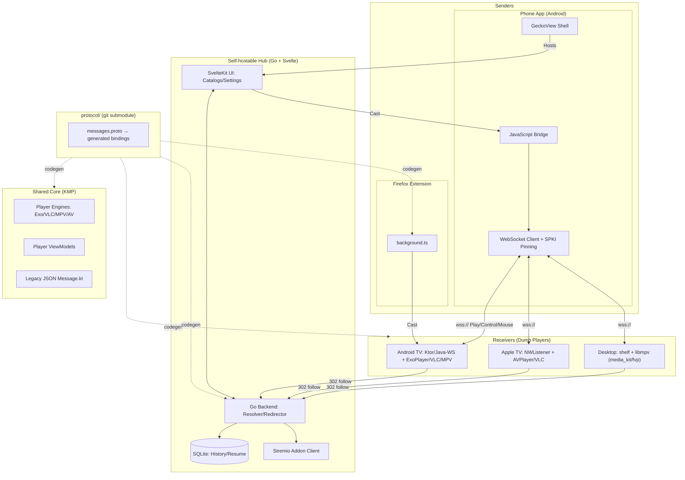

# PlayBridge Architecture
_Last verified: 2026-05-23_

This document provides a project-wide architecture overview of PlayBridge. Per-module deep dives are linked at the bottom.

---

## Project Overview

**PlayBridge** is a multi-platform casting suite: an Android phone or desktop browser **sends** video URLs and control commands to a TV/desktop **receiver** over the LAN. A self-hostable **Hub** adds catalogs, metadata, and stream resolution. Shared logic is in a Kotlin Multiplatform (KMP) library; the wire protocol is a protobuf schema kept in a git submodule and code-generated into every language.

| Module | Path | Role |
| :--- | :--- | :--- |
| **Phone (Sender)** | `mobile/android/` | Android shell (GeckoView browser + Hub UI); casts to receivers |
| **Desktop (Receiver)** | `desktop/` | Flutter app (macOS/Windows/Linux); libmpv player; runs a wss server |
| **Integrated Hub** | `hub/` | Self-hostable content hub (Go backend + SvelteKit UI) |
| **TV (Android)** | `tv/android/player/` | Android TV receiver (dumb player: ExoPlayer/MPV/VLC) |
| **TV Browser** | `tv/android/browser/` | Standalone Android TV browser |
| **TV (Apple)** | `tv/apple/` | Native tvOS receiver (dumb player: AVPlayer/VLC) |
| **Shared (Core)** | `shared/` | KMP library: player engines + business logic |
| **Protocol** | `protocol/` | **git submodule** — protobuf source of truth + generated bindings |
| **Extension** | `extension/` | Firefox desktop extension (TypeScript) |
| **Web** | `web/site/` | SvelteKit marketing/landing site |

---

## Architecture Diagram



---

## Project Structure

```
PlayBridge/
├── mobile/android/      # Android Phone (Sender) — standalone Gradle build (PlayBridgePhone)
├── desktop/             # Flutter desktop receiver (macOS/Windows/Linux)
├── hub/                 # Self-hostable Hub (Go backend + SvelteKit UI)
├── tv/
│   ├── android/         # Android TV — standalone Gradle build (PlayBridgeTV)
│   │   ├── player/      #   TV receiver (player app)
│   │   └── browser/     #   standalone TV browser
│   └── apple/           # Native Apple TV (tvOS) app
├── shared/              # Kotlin Multiplatform core (engines + logic); included by consumers
├── protocol/            # git submodule: protobuf schema + generated bindings (5 langs)
├── extension/           # Firefox desktop extension (TypeScript)
├── web/site/            # SvelteKit marketing site
├── scripts/             # maintenance & automation
└── libs/                # local libraries (mpv-android, etc.)
```

> **Build topology note:** `mobile/android` and `tv/android` are *independent* Gradle builds (each has its own `gradlew`/`settings.gradle.kts`) that both include `shared` via `project(":shared").projectDir = File("../../shared")`. There is no root-level Gradle build.

---

## Secure Transport (wss/TLS)

The phone↔receiver control channel carries `Cookie`/`Authorization` headers and signed URLs in `PlayPayload`, so it is moving from plaintext `ws://` to `wss://` with **trust-on-first-use SPKI pinning** bootstrapped at pairing:

- Each receiver self-signs a long-lived cert on first run and advertises its **SPKI pin** (`sha256/<base64>`) in `PairingApprovedMessage` / `AuthResponse` (and a `wss_port` mDNS TXT hint).
- Senders persist the pin next to the auth token and validate the presented cert on every connection; a mismatch is refused (possible MITM).
- Receivers default to **wss-only** (port 8766); plaintext `ws://` (8765) runs only when "Allow insecure" is enabled or for the same-device loopback in-app browser.
- The Firefox extension cannot pin a self-signed LAN cert and is treated as out-of-scope for v1.

Full per-platform status and remaining work: [`WSS_MIGRATION_PLAN.md`](WSS_MIGRATION_PLAN.md).

---

## Per-Module Architecture
- 👉 [Phone (Android) Architecture](mobile/android/ARCHITECTURE.md)
- 👉 [Desktop (Flutter) Architecture](desktop/ARCHITECTURE.md)
- 👉 [Hub Architecture](hub/ARCHITECTURE.md)
- 👉 [Android TV Architecture](tv/ARCHITECTURE.md)
- 👉 [Apple TV Architecture](tv/apple/ARCHITECTURE.md)
- 👉 [Shared (KMP) Architecture](shared/ARCHITECTURE.md)
- 👉 [Protocol Architecture](protocol/ARCHITECTURE.md)
- 👉 [Extension Architecture](extension/ARCHITECTURE.md)
- 👉 [Web Site Architecture](web/site/ARCHITECTURE.md)

---

## Open-Source / Play Store Readiness

### ✅ Already Good
- [x] Network security config scoped to local network only
- [x] Unified shared module — single source of truth for player engines/logic
- [x] Protobuf protocol submodule — single source of truth for the wire format
- [x] PIN + token authentication for pairing/discovery
- [x] **Encrypted control channel (wss + SPKI pinning), wss-only by default**
- [x] GitHub Actions CI for all modules
- [x] Multi-engine support across senders/receivers
- [x] Cross-platform reach (Android, tvOS, Firefox, desktop Flutter)

### ❌ Outstanding
- [ ] Review commit history for accidentally committed secrets before going public
- [ ] wss interop test matrix + MITM/sniff validation (`WSS_MIGRATION_PLAN.md` Phase 4)
- [ ] Decide the browser-extension secure-transport story (loopback-only vs drop)
- [ ] Play Store (TV app): privacy policy, data-safety form, content rating, AAB build, R8 keep-rules — see [`tv/ARCHITECTURE.md`](tv/ARCHITECTURE.md)

---

## Summary

**Strengths**
- Clean sender/receiver separation with a "dumb receiver" model and a single resolving Hub.
- Modern stack: Compose/Compose-TV, Kotlin Serialization + protobuf, Coroutines, GeckoView, Media3; Flutter + libmpv on desktop; SwiftUI + AVFoundation on tvOS.
- One protobuf schema generates bindings for Kotlin, Swift, Dart, TypeScript, and Go.
- Feature-rich phone sender (browser, Debrid, library/TMDB, HLS, downloads, history, bookmarks) and capable receivers (multi-engine playback, ad blocking, subtitles, track selection, filters).
- Encrypted, pinned control channel — the most security-sensitive piece — is largely in place.

**Key actions before open-sourcing**
1. Audit commit history for secrets.
2. Finish the wss interop/validation matrix.

**Key actions before Play Store (TV app)**
1. Remove any global cleartext-traffic permission once wss cutover completes.
2. Remove unused permissions; create/host a Privacy Policy; complete Play Console (data safety, content rating, listing); ship AAB with R8 keep-rules.
