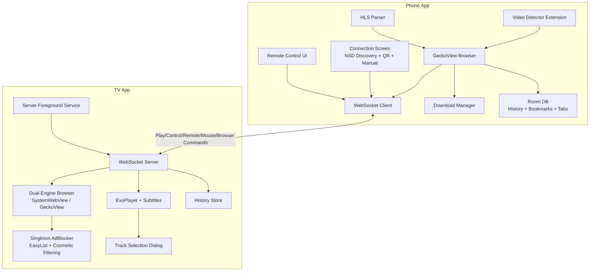
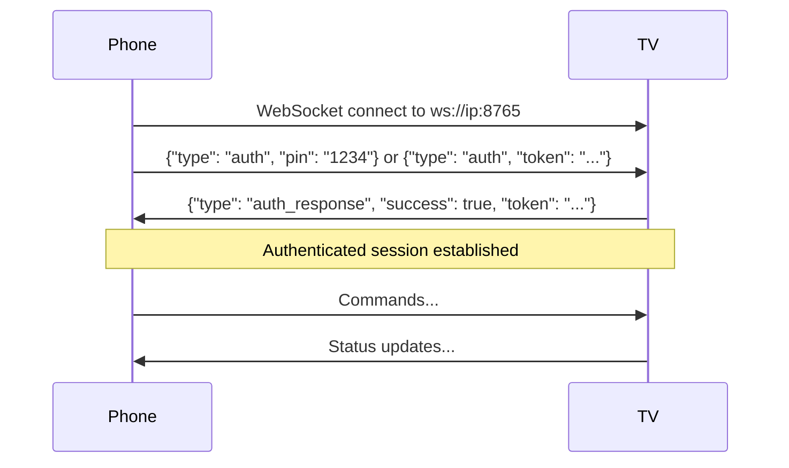

# PlayBridge Architecture Review & Open-Source Recommendations

This document provides a comprehensive architecture review of the PlayBridge project and actionable recommendations before open-sourcing.

---

## Project Overview

**PlayBridge** is a casting solution enabling Android phones to send video URLs and browser control commands to Android TV devices. The project consists of two independent Android applications and a shared protocol module:

| Module | Package | Purpose |
|--------|---------|---------|
| **Phone (Sender)** | `com.playbridge.sender` | GeckoView-based browser with video detection, downloads, bookmarks, remote control, sends commands to TV |
| **TV (Receiver)** | `com.playbridge.receiver` | WebSocket server + ExoPlayer + dual-engine browser (SystemWebView/GeckoView) with ad blocking, receives and plays video streams |
| **Protocol** | `com.playbridge.protocol` | Shared protocol: NSD constants, message classes, command parser, and helper functions |
| **Extension** | `extension/` | Standalone browser extension for Firefox (V2) and Chrome (V3). Direct WebSocket connection to TV for desktop |

---

## Architecture Diagram



---

## Phone App Architecture

### Package Structure
```
com.playbridge.sender/
├── browser/                # GeckoView browser, video detection, extensions, downloads
│   ├── AddonInstallDialog.kt       (extension install confirmation dialog)
│   ├── BookmarksScreen.kt          (bookmarks list UI with add/remove)
│   ├── BrowserActivity.kt          (main browser activity, ~1330 lines)
│   ├── BrowserToolbar.kt           (custom Compose toolbar with URL bar, navigation, SSL lock, menu)
│   ├── Components.kt               (singleton DI container for GeckoRuntime, BrowserStore)
│   ├── DetectedVideosSheet.kt      (bottom sheet for detected videos + quality selection)
│   ├── DownloadConfirmDialog.kt    (download confirmation dialog + PendingDownload model)
│   ├── DownloadManagerSingleton.kt  (Media3 ExoPlayer download manager for HLS)
│   ├── DownloadsScreen.kt          (downloads list UI with progress tracking)
│   ├── DownloadUtils.kt            (download helpers: enqueue, file size, error strings)
│   ├── ExtensionsScreen.kt         (addon management screen)
│   ├── FindOnPageBar.kt            (UI for in-page text search)
│   ├── HistoryScreen.kt            (browsing history list UI)
│   ├── HlsParser.kt               (HLS manifest parsing for quality selection with audio tracks)
│   ├── HomeScreen.kt               (browser home page with bookmarks)
│   ├── LinkContextMenu.kt          (long-press link context menu dialog)
│   ├── MediaDownloadService.kt     (foreground service for HLS/media downloads)
│   ├── RemoteControlSheet.kt       (TV remote control: D-pad, touchpad, player controls)
│   ├── SessionObserverSetup.kt     (session observer + GeckoSession delegate proxies)
│   ├── SettingsScreen.kt           (browser settings: inbuilt extension visibility)
│   ├── TabManager.kt               (tab/session lifecycle, find-in-page helpers)
│   ├── TabsScreen.kt               (tab management overlay)
│   └── VideoDetector.kt            (video content type detection via request interception)
├── connection/             # WebSocket client + service discovery
│   ├── ConnectionStore.kt          (DataStore persistence for connection history)
│   ├── NsdHelper.kt                (Network Service Discovery to find TV services)
│   └── WebSocketClient.kt          (OkHttp-based client with auto-retry)
├── data/                   # Local data persistence
│   └── history/
│       ├── BookmarkDao.kt           (Room DAO for bookmarks CRUD)
│       ├── BookmarkEntity.kt        (Bookmark entry data class: url, title, timestamp)
│       ├── DatabaseProvider.kt      (Room database singleton provider)
│       ├── HistoryDao.kt            (Room DAO for browsing history CRUD)
│       ├── HistoryDatabase.kt       (Room database definition with history, bookmarks, tabs)
│       ├── HistoryEntity.kt         (History entry data class: url, title, timestamp)
│       ├── TabDao.kt                (Room DAO for tab persistence)
│       └── TabEntity.kt             (Tab state data class: id, url, title, parentId, isSelected)
├── model/                  # App-specific models
│   ├── Message.kt                   (QRCodeData + parseQRCode — phone-only)
│   └── TvDevice.kt                  (TV device connection info)
└── ui/                     # Compose UI screens
    ├── ConnectionScreen.kt          (NSD discovery + QR scan + manual IP + PIN auth)
    ├── HomeScreen.kt                (main home with device connection)
    └── theme/
```

### Key Components

| Component | File | Purpose |
|-----------|------|---------|
| Browser Engine | [Components.kt](file:///Users/atulmehla/repos/personal/PlayBridge/phone/app/src/main/java/com/playbridge/sender/browser/Components.kt) | Singleton DI container for GeckoRuntime, BrowserStore, AddonManager |
| Browser UI | [BrowserActivity.kt](file:///Users/atulmehla/repos/personal/PlayBridge/phone/app/src/main/java/com/playbridge/sender/browser/BrowserActivity.kt) | Main browser activity (~1330 lines) with UI composition, screen routing, toolbar, dropdown menu, tab persistence |
| Browser Toolbar | [BrowserToolbar.kt](file:///Users/atulmehla/repos/personal/PlayBridge/phone/app/src/main/java/com/playbridge/sender/browser/BrowserToolbar.kt) | Custom Compose toolbar with navigation, URL bar (full-width on edit), SSL lock indicator, desktop mode toggle, menu |
| Tab Management | [TabManager.kt](file:///Users/atulmehla/repos/personal/PlayBridge/phone/app/src/main/java/com/playbridge/sender/browser/TabManager.kt) | Tab/session lifecycle, session sync, find-in-page helpers |
| Tab UI | [TabsScreen.kt](file:///Users/atulmehla/repos/personal/PlayBridge/phone/app/src/main/java/com/playbridge/sender/browser/TabsScreen.kt) | Tab list/grid overlay with thumbnails |
| Session Observer | [SessionObserverSetup.kt](file:///Users/atulmehla/repos/personal/PlayBridge/phone/app/src/main/java/com/playbridge/sender/browser/SessionObserverSetup.kt) | EngineSession.Observer + GeckoSession delegate proxies, desktop mode user-agent switching |
| Extension Management | [ExtensionsScreen.kt](file:///Users/atulmehla/repos/personal/PlayBridge/phone/app/src/main/java/com/playbridge/sender/browser/ExtensionsScreen.kt) | Addon installation and management UI |
| Addon Install | [AddonInstallDialog.kt](file:///Users/atulmehla/repos/personal/PlayBridge/phone/app/src/main/java/com/playbridge/sender/browser/AddonInstallDialog.kt) | Extension installation confirmation dialog |
| Remote Control | [RemoteControlSheet.kt](file:///Users/atulmehla/repos/personal/PlayBridge/phone/app/src/main/java/com/playbridge/sender/browser/RemoteControlSheet.kt) | Context-aware D-pad, touchpad, and player controls for TV |
| HLS Parser | [HlsParser.kt](file:///Users/atulmehla/repos/personal/PlayBridge/phone/app/src/main/java/com/playbridge/sender/browser/HlsParser.kt) | Parses HLS manifests for quality selection with audio track support |
| Video Detection | [VideoDetector.kt](file:///Users/atulmehla/repos/personal/PlayBridge/phone/app/src/main/java/com/playbridge/sender/browser/VideoDetector.kt) | Video content type detection via request interception |
| Downloads | [DownloadsScreen.kt](file:///Users/atulmehla/repos/personal/PlayBridge/phone/app/src/main/java/com/playbridge/sender/browser/DownloadsScreen.kt) | Download list UI (system + HLS/ExoPlayer downloads) |
| Download Utils | [DownloadUtils.kt](file:///Users/atulmehla/repos/personal/PlayBridge/phone/app/src/main/java/com/playbridge/sender/browser/DownloadUtils.kt) | Download helper: standard files via DownloadManager, HLS via ExoPlayer DownloadService |
| HLS Download Manager | [DownloadManagerSingleton.kt](file:///Users/atulmehla/repos/personal/PlayBridge/phone/app/src/main/java/com/playbridge/sender/browser/DownloadManagerSingleton.kt) | Media3 ExoPlayer download manager singleton for HLS offline downloads |
| Media Download Service | [MediaDownloadService.kt](file:///Users/atulmehla/repos/personal/PlayBridge/phone/app/src/main/java/com/playbridge/sender/browser/MediaDownloadService.kt) | Foreground service for HLS media downloads with notifications |
| Browser Settings | [SettingsScreen.kt](file:///Users/atulmehla/repos/personal/PlayBridge/phone/app/src/main/java/com/playbridge/sender/browser/SettingsScreen.kt) | Browser settings (e.g., toggle inbuilt extension visibility) |
| Browser History | [HistoryScreen.kt](file:///Users/atulmehla/repos/personal/PlayBridge/phone/app/src/main/java/com/playbridge/sender/browser/HistoryScreen.kt) | Browsing history list with clear functionality |
| Bookmarks | [BookmarksScreen.kt](file:///Users/atulmehla/repos/personal/PlayBridge/phone/app/src/main/java/com/playbridge/sender/browser/BookmarksScreen.kt) | Bookmarks list UI with add/remove |
| Home Page | [HomeScreen.kt](file:///Users/atulmehla/repos/personal/PlayBridge/phone/app/src/main/java/com/playbridge/sender/browser/HomeScreen.kt) | Browser home page with bookmarks display |
| Database | [DatabaseProvider.kt](file:///Users/atulmehla/repos/personal/PlayBridge/phone/app/src/main/java/com/playbridge/sender/data/history/DatabaseProvider.kt) | Room database singleton with History, Bookmark, and Tab DAOs |
| Tab Persistence | [TabDao.kt](file:///Users/atulmehla/repos/personal/PlayBridge/phone/app/src/main/java/com/playbridge/sender/data/history/TabDao.kt) | Room DAO for saving/restoring tab state across sessions |
| Find on Page | [FindOnPageBar.kt](file:///Users/atulmehla/repos/personal/PlayBridge/phone/app/src/main/java/com/playbridge/sender/browser/FindOnPageBar.kt) | UI for finding text within web pages |
| WebSocket | [WebSocketClient.kt](file:///Users/atulmehla/repos/personal/PlayBridge/phone/app/src/main/java/com/playbridge/sender/connection/WebSocketClient.kt) | OkHttp-based client with auto-retry (60 attempts, 5s intervals) |
| Connection | [ConnectionScreen.kt](file:///Users/atulmehla/repos/personal/PlayBridge/phone/app/src/main/java/com/playbridge/sender/ui/ConnectionScreen.kt) | NSD auto-discovery, QR scanning, manual IP entry, PIN authentication |
| Service Discovery | [NsdHelper.kt](file:///Users/atulmehla/repos/personal/PlayBridge/phone/app/src/main/java/com/playbridge/sender/connection/NsdHelper.kt) | Network Service Discovery to find TV services on local network |
| Embedded Extension | `assets/extensions/video_detector` | Legacy internal extension bundled with the phone app for video detection in GeckoView |

### Dependencies
- **GeckoView** (Mozilla) v147 — Full Firefox engine
- **Mozilla Android Components** v147 — Tabs, toolbar, extensions, sessions, prompts support
- **OkHttp** v4.12 — WebSocket client
- **CameraX** v1.4 + **ML Kit Barcode** v17.3 — QR code scanning
- **Jetpack Compose** — UI (Material3)
- **Kotlin Serialization** v1.7 — JSON protocol
- **DataStore** v1.1 — Preferences persistence
- **Room** — SQLite persistence for browsing history
- **Media3 ExoPlayer** — HLS offline download support
- **Coil** — Image loading

---

## TV App Architecture

### Package Structure
```
com.playbridge.receiver/
├── MainActivity.kt                # Compose navigation + screen state management + AdBlocker preload (~209 lines)
├── browser/                       # Dual-engine TV browser
│   ├── AdBlocker.kt               (Singleton ad blocker: EasyList, EasyPrivacy, cosmetic filtering, popup blocking, ~649 lines)
│   ├── BrowserActivity.kt         (TV browser activity with remote input, video maximize/restore, ~773 lines)
│   ├── BrowserEngine.kt           (Browser engine interface: loadUrl, reload, goBack, evaluateJavascript, etc.)
│   ├── GeckoViewEngine.kt         (GeckoView engine with bundled uBlock Origin)
│   └── SystemWebViewEngine.kt     (Android WebView engine with JS popup/redirect blocking, cosmetic CSS injection)
├── data/                          # Persistence
│   └── HistoryStore.kt            (DataStore-based playback history)
├── model/                         # App-specific models
│   └── PairedDevice.kt            (paired device info)
├── pairing/                       # QR code display, token management
│   ├── PairingStore.kt            (DataStore persistence for auth tokens)
│   └── QRGenerator.kt             (ZXing QR code bitmap generation)
├── player/                        # Video playback
│   ├── ContentSniffer.kt          (SSL-bypass OkHttpClient + content type sniffing)
│   ├── InputHandler.kt            (D-pad, phone remote, control command handling)
│   ├── PlayerActivity.kt          (~648 lines, ExoPlayer with HLS/DASH/RTSP)
│   ├── PlayerControlsManager.kt   (custom controls overlay, seekbar, scrubbing)
│   ├── ProgressManager.kt         (progress save/restore, thumbnail capture)
│   ├── SubtitleManager.kt         (SRT/VTT subtitle parser + sync engine)
│   └── TrackSelectionDialog.kt    (Compose TV dialog for audio/video/subtitle track selection)
├── server/                        # WebSocket server
│   ├── ServerService.kt           (foreground service + command routing, ~388 lines)
│   └── WebSocketServer.kt         (Ktor-based WebSocket server)
└── ui/                            # Compose TV UI screens
    ├── HistoryScreen.kt
    ├── HomeScreen.kt
    ├── PairingScreen.kt
    ├── SettingsScreen.kt
    └── theme/
```

### Key Components

| Component | File | Purpose |
|-----------|------|---------|
| WebSocket Server | [WebSocketServer.kt](file:///Users/atulmehla/repos/personal/PlayBridge/tv/app/src/main/java/com/playbridge/receiver/server/WebSocketServer.kt) | Ktor Netty server on port 8765 with auth |
| Server Service | [ServerService.kt](file:///Users/atulmehla/repos/personal/PlayBridge/tv/app/src/main/java/com/playbridge/receiver/server/ServerService.kt) | Foreground service managing server lifecycle, command routing, NSD registration, context broadcasting |
| Video Player | [PlayerActivity.kt](file:///Users/atulmehla/repos/personal/PlayBridge/tv/app/src/main/java/com/playbridge/receiver/player/PlayerActivity.kt) | ExoPlayer activity with media source construction, track selection |
| Player Controls | [PlayerControlsManager.kt](file:///Users/atulmehla/repos/personal/PlayBridge/tv/app/src/main/java/com/playbridge/receiver/player/PlayerControlsManager.kt) | Custom controls overlay, seekbar, play/pause, scrubbing |
| Input Handler | [InputHandler.kt](file:///Users/atulmehla/repos/personal/PlayBridge/tv/app/src/main/java/com/playbridge/receiver/player/InputHandler.kt) | D-pad, phone remote, control commands |
| Progress Manager | [ProgressManager.kt](file:///Users/atulmehla/repos/personal/PlayBridge/tv/app/src/main/java/com/playbridge/receiver/player/ProgressManager.kt) | Playback progress save/restore, thumbnail capture |
| Content Sniffer | [ContentSniffer.kt](file:///Users/atulmehla/repos/personal/PlayBridge/tv/app/src/main/java/com/playbridge/receiver/player/ContentSniffer.kt) | SSL-bypass OkHttpClient, pre-flight content type detection |
| Subtitle Manager | [SubtitleManager.kt](file:///Users/atulmehla/repos/personal/PlayBridge/tv/app/src/main/java/com/playbridge/receiver/player/SubtitleManager.kt) | External subtitle support (SRT/VTT parsing, download, timed sync with player position) |
| Track Selection | [TrackSelectionDialog.kt](file:///Users/atulmehla/repos/personal/PlayBridge/tv/app/src/main/java/com/playbridge/receiver/player/TrackSelectionDialog.kt) | Compose TV dialog for selecting audio, video, and subtitle tracks (embedded + external) |
| Protocol & Commands | [Message.kt](file:///Users/atulmehla/repos/personal/PlayBridge/protocol/src/main/java/com/playbridge/protocol/Message.kt) | Shared protocol: sealed `Command` class, message parsing, JSON helpers (in `protocol` module) |
| Browser Engine Interface | [BrowserEngine.kt](file:///Users/atulmehla/repos/personal/PlayBridge/tv/app/src/main/java/com/playbridge/receiver/browser/BrowserEngine.kt) | Abstraction for swappable browser engines (loadUrl, reload, evaluateJavascript, etc.) |
| SystemWebView Engine | [SystemWebViewEngine.kt](file:///Users/atulmehla/repos/personal/PlayBridge/tv/app/src/main/java/com/playbridge/receiver/browser/SystemWebViewEngine.kt) | Android WebView engine with JS-based popup/redirect blocking, cosmetic CSS injection, ad request interception |
| GeckoView Engine | [GeckoViewEngine.kt](file:///Users/atulmehla/repos/personal/PlayBridge/tv/app/src/main/java/com/playbridge/receiver/browser/GeckoViewEngine.kt) | GeckoView engine with bundled uBlock Origin for advanced ad blocking |
| Ad Blocker | [AdBlocker.kt](file:///Users/atulmehla/repos/personal/PlayBridge/tv/app/src/main/java/com/playbridge/receiver/browser/AdBlocker.kt) | Singleton ad blocker preloaded at app startup; EasyList + EasyPrivacy + Adblock Warning Removal List, cosmetic filtering, popup/document blocking |
| TV Browser | [BrowserActivity.kt](file:///Users/atulmehla/repos/personal/PlayBridge/tv/app/src/main/java/com/playbridge/receiver/browser/BrowserActivity.kt) | TV browser with dual-engine switching, remote input, fullscreen handling, JS-based video maximize/restore, cursor control |
| QR Generator | [QRGenerator.kt](file:///Users/atulmehla/repos/personal/PlayBridge/tv/app/src/main/java/com/playbridge/receiver/pairing/QRGenerator.kt) | ZXing-based QR code generation for pairing (includes IP, port, token, name) |
| Settings | [SettingsScreen.kt](file:///Users/atulmehla/repos/personal/PlayBridge/tv/app/src/main/java/com/playbridge/receiver/ui/SettingsScreen.kt) | TV app settings UI |

### Dependencies
- **Ktor** v3.0 (Netty) — WebSocket server
- **Media3 ExoPlayer** v1.5 — Full streaming suite (HLS, DASH, RTSP, Smooth Streaming)
- **Media3 Session** — Media session support
- **Media3 DataSource OkHttp** — HTTP performance with OkHttp backend
- **ZXing** v3.5 — QR code generation
- **Jetpack Compose TV** — TV-optimized UI (tv-foundation, tv-material)
- **Coil** v3.3 — Image loading (with OkHttp network backend)
- **OkHttp** v4.12 — HTTP client for ExoPlayer data source + URL connections
- **Kotlin Serialization** v1.7 — JSON protocol
- **DataStore** v1.1 — Preferences persistence

---

## Standalone Browser Extension

A standalone extension architecture exists in the `extension/` directory to bring PlayBridge casting capabilities to desktop browsers.
This is a cross-platform Web Extension that builds for:
1. **Firefox (Desktop)** (Manifest V2, direct WebSocket connection to TV, injected Shadow DOM UI)
2. **Chrome (Desktop)** (Manifest V3, direct WebSocket connection to TV, injected Shadow DOM UI)

*(Note: The Android Phone app uses its own dedicated, lightweight legacy extension found in `phone/app/src/main/assets/extensions/video_detector` for internal GeckoView communication).*

### Key Components

| Component | File | Purpose |
|-----------|------|---------|
| Build System | `extension/build.js` | Generates target-specific extensions and `manifest.json` versions |
| Background Script | `extension/src/background.js` | Video detection logic, WebSocket client for direct TV connection |
| Content Script | `extension/src/content.js` | In-page video UI (Shadow DOM floating button) |
| Extension UI | `extension/src/popup.*` | Video list view and TV connection settings |

---

## Protocol Module

The `protocol` module (`com.playbridge.protocol`) is a shared Kotlin JVM library consumed by both apps via `implementation(project(":protocol"))`. It contains:

| File | Contents |
|------|----------|
| [NsdConstants.kt](file:///Users/atulmehla/repos/personal/PlayBridge/protocol/src/main/java/com/playbridge/protocol/NsdConstants.kt) | NSD service type and key constants |
| [Message.kt](file:///Users/atulmehla/repos/personal/PlayBridge/protocol/src/main/java/com/playbridge/protocol/Message.kt) | All shared protocol classes, sealed `Command` class, `parseCommand()`, and 14 helper functions |

**Dependencies:** Kotlin JVM, `kotlinx-serialization-json:1.7.3`

---

## Communication Protocol

Commands flow bidirectionally between Phone ↔ TV via WebSocket JSON messages:

### Connection & Authentication Flow



### Phone → TV Commands

```json
// Play video (with optional headers, content type, and external subtitles)
{"type": "command", "action": "play", "payload": {"url": "...", "title": "...", "headers": {...}, "contentType": "...", "subtitles": ["url1.srt", "url2.vtt"]}}

// Open browser on TV
{"type": "command", "action": "browser", "payload": {"url": "..."}}

// Player control
{"type": "command", "action": "control", "payload": {"command": "pause"}}

// Remote control (D-pad navigation)
{"type": "command", "action": "remote", "payload": {"key": "dpad_up"}}

// Mouse/touchpad control
{"type": "command", "action": "mouse", "payload": {"event": "move", "dx": 10.5, "dy": -3.2}}

// Browser control (refresh, switch engine, maximize/restore video)
{"type": "command", "action": "browser_control", "payload": {"action": "refresh"}}
{"type": "command", "action": "browser_control", "payload": {"action": "maximize_video"}}
{"type": "command", "action": "browser_control", "payload": {"action": "restore_video"}}
{"type": "command", "action": "browser_control", "payload": {"action": "switch_engine"}}

// Context query (ask TV what screen it's on)
{"type": "command", "action": "context_query"}

// Heartbeat
{"type": "ping"}
```

### TV → Phone Responses

```json
// Authentication response
{"type": "auth_response", "success": true, "token": "generated-token"}

// Playback status
{"type": "status", "state": "playing", "position": 12345, "duration": 60000, "title": "..."}

// Context response
{"type": "context", "active": "player"}  // "player", "browser", or "idle"

// Heartbeat
{"type": "pong"}
```

---

## Issues & Refactoring Recommendations

### ✅ Resolved Issues

#### ~~1. Duplicated Protocol Code~~ ✅ RESOLVED
- **Resolved**: All shared protocol code has been migrated to `protocol/src/main/java/com/playbridge/protocol/Message.kt`. Phone `model/Message.kt` now only contains `QRCodeData`. TV `model/Message.kt` has been deleted.

### 🔴 Critical Issues

#### ~~2. Very Large File: BrowserActivity.kt (~1555 lines)~~
- ✅ **RESOLVED**: Extracted `TabManager.kt`, `SessionObserverSetup.kt`, `DownloadConfirmDialog.kt`, and `LinkContextMenu.kt`. `BrowserActivity.kt` reduced to ~1115 lines.

#### ~~3. Large File: PlayerActivity.kt (~1125 lines)~~
- ✅ **RESOLVED**: Extracted `ContentSniffer.kt`, `PlayerControlsManager.kt`, `ProgressManager.kt`, and `InputHandler.kt`. `PlayerActivity.kt` reduced to ~592 lines.

### 🟡 Moderate Issues

#### 4. Unsafe SSL in PlayerActivity
- **Problem**: `getUnsafeOkHttpClient()` trusts all certificates
- **Impact**: Security vulnerability for MITM attacks
- **Recommendation**: Make this optional/configurable with clear warnings

#### 5. Hardcoded Values
- Port `8765` hardcoded across both apps
- Retry counts (60), delays (5s) embedded in code
- **Recommendation**: Move to a `config` object or DataStore preferences

#### 6. Missing Error Handling in Extensions
- Browser extension silently catches errors in [background.js:76-89](file:///Users/atulmehla/repos/personal/PlayBridge/phone/app/src/main/assets/extensions/video_detector/background.js#L76) (3 separate silent catches)
- **Recommendation**: Add proper error logging/reporting

### 🟢 Minor Improvements

#### 7. Components.kt is Not True DI
- Uses lazy singletons, not proper dependency injection
- **Recommendation**: Consider Hilt/Koin for testability, or keep as-is if testing isn't a priority

#### 8. ProGuard Rules Minimal
- Default ProGuard rules may strip needed Kotlin serialization classes
- **Recommendation**: Add rules for kotlinx.serialization, Ktor, etc.

---

## Open-Source Preparation Checklist

### ✅ Already Good
- [x] `.gitignore` properly configured (34 entries covering build, IDE, keystore, OS files)
- [x] GitHub Actions CI exists ([android_build.yml](file:///Users/atulmehla/repos/personal/PlayBridge/.github/workflows/android_build.yml))
- [x] Clean package structure with clear separation
- [x] Well-documented protocol messages with KDoc
- [x] Sealed class pattern for type-safe command handling (shared protocol module)
- [x] Unified protocol module — single source of truth for message classes
- [x] Context-aware remote control (phone queries TV for active screen)
- [x] Authentication implemented (Token/PIN validation via QR code pairing)
- [x] README.md created
- [x] LICENSE file added
- [x] Room database for browsing history, bookmarks, and tab persistence (phone)
- [x] Subtitle support (SRT/VTT) with external URLs
- [x] Dual-engine TV browser (SystemWebView + GeckoView) with runtime switching
- [x] Ad blocking with EasyList, EasyPrivacy, cosmetic filtering, and popup blocking
- [x] Bookmarks support (phone)
- [x] Tab persistence across app restarts (phone)
- [x] Desktop mode toggle (phone)
- [x] SSL lock indicator (phone)
- [x] Video maximize/restore via JS injection (TV browser)

### ❌ Missing for Open-Source

#### 1. CONTRIBUTING.md
Guidelines for:
- Code style
- Pull request process
- Issue templates

#### 2. Security Considerations Documentation
Document:
- Local network assumption
- SSL bypass option and when to use it

#### 3. Remove/Review Sensitive Data
- Check `local.properties` is gitignored ✅
- Remove any hardcoded API keys or tokens
- Review commit history for accidentally committed secrets

#### 4. Build Configuration
- Both apps have `isMinifyEnabled = false` for release
- Consider enabling for production releases with proper ProGuard rules

---

## Suggested Project Structure (Refactored)

```
PlayBridge/
├── README.md
├── LICENSE
├── CONTRIBUTING.md              # NEW
├── .github/
│   ├── workflows/
│   │   └── android_build.yml
│   └── ISSUE_TEMPLATE/          # NEW
├── extension/                   # Standalone Desktop Web Extension
│   ├── build.js                 # Cross-platform build script
│   └── src/                     # Shared extension code (Chrome, Firefox)
├── protocol/                    # Shared module
│   ├── build.gradle.kts
│   └── src/main/java/com/playbridge/protocol/
│       ├── NsdConstants.kt
│       └── Message.kt           # Unified protocol messages + sealed Command class
├── phone/
│   ├── app/
│   │   └── src/main/
│   │       ├── java/com/playbridge/sender/
│   │       │   ├── browser/
│   │       │   │   ├── BrowserActivity.kt    (~1115 lines, slimmed down)
│   │       │   │   ├── BrowserToolbar.kt
│   │       │   │   ├── TabManager.kt           (tab/session lifecycle)
│   │       │   │   ├── SessionObserverSetup.kt (observer + delegates)
│   │       │   │   ├── DownloadConfirmDialog.kt
│   │       │   │   ├── LinkContextMenu.kt
│   │       │   │   ├── TabsScreen.kt
│   │       │   │   ├── ExtensionsScreen.kt
│   │       │   │   ├── RemoteControlSheet.kt
│   │       │   │   ├── DownloadsScreen.kt
│   │       │   │   ├── HistoryScreen.kt
│   │       │   │   ├── SettingsScreen.kt
│   │       │   │   ├── HlsParser.kt
│   │       │   │   └── ...
│   │       │   ├── connection/
│   │       │   ├── data/history/
│   │       │   ├── model/
│   │       │   └── ui/
│   │       └── assets/extensions/video_detector/  # Embedded legacy phone extension
│   └── build.gradle.kts
└── tv/
    ├── app/
    │   └── src/main/
    │       ├── java/com/playbridge/receiver/
    │       │   ├── browser/
    │       │   ├── pairing/
    │       │   ├── player/
    │       │   │   ├── PlayerActivity.kt   (~592 lines, slimmed down)
    │       │   │   ├── ContentSniffer.kt
    │       │   │   ├── PlayerControlsManager.kt
    │       │   │   ├── ProgressManager.kt
    │       │   │   ├── InputHandler.kt
    │       │   │   ├── SubtitleManager.kt
    │       │   │   └── TrackSelectionDialog.kt
    │       │   ├── server/
    │       │   ├── ui/
    │       │   └── model/
    │       └── res/layout/
    └── build.gradle.kts
```

---

## Priority Recommendations

| Priority | Task | Effort |
|----------|------|--------|
| 🔴 High | Add CONTRIBUTING.md | 30 minutes |
| ~~🟡 Medium~~ | ~~Migrate messages to shared protocol module~~ | ✅ Done |
| ~~🟡 Medium~~ | ~~Further slim BrowserActivity.kt (~1555 lines)~~ | ✅ Done |
| ~~🟡 Medium~~ | ~~Extract PlayerActivity.kt logic (~1125 lines)~~ | ✅ Done |
| 🟢 Low | Enable ProGuard for release | 2-4 hours |

---

## Summary

**Strengths:**
- Clean architecture with clear separation between sender/receiver
- Modern tech stack (Compose, Kotlin Serialization, Coroutines, GeckoView v147, Media3 v1.5)
- Well-designed protocol with extensible command structure (play, browser, control, remote, mouse, browser_control, context_query)
- Good use of sealed classes for type-safe command handling
- Feature-rich phone app with remote control, touchpad, HLS quality parsing, extension management, tab management, download support (standard + HLS), browsing history (Room DB), bookmarks, tab persistence, desktop mode, and SSL lock indicator
- TV app has dual-engine browser (SystemWebView/GeckoView) with runtime switching, comprehensive ad blocking (EasyList + cosmetic filtering + popup blocking), video maximize/restore via JS injection, subtitle support (SRT/VTT), track selection dialog, context broadcasting, settings, and foreground service architecture
- AdBlocker is a singleton preloaded at app startup for instant protection when browser opens
- Authentication fully implemented with PIN + token flow via QR code pairing
- NSD auto-discovery for seamless phone-to-TV connection

**Key Actions Before Open-Sourcing:**
1. Add CONTRIBUTING.md
2. ~~Expand .gitignore~~ ✅
3. ~~Extract shared protocol module~~ ✅
4. Document security considerations (SSL bypass, local network assumptions)

The codebase is in good shape for open-sourcing with relatively minor documentation additions.
