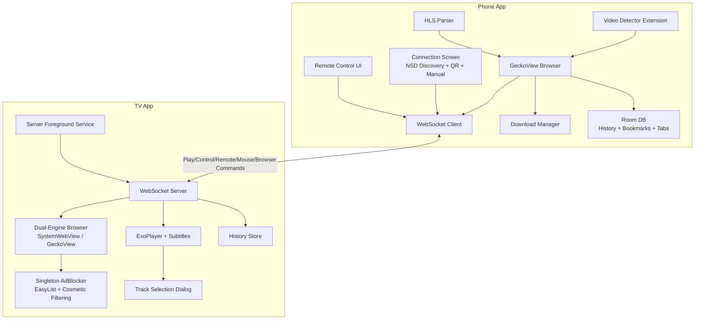

# PlayBridge Architecture Review & Open-Source Recommendations

This document provides a comprehensive architecture review of the PlayBridge project and actionable recommendations before open-sourcing.

---

## Project Overview

**PlayBridge** is a casting solution enabling Android phones to send video URLs and browser control commands to Android TV devices. The project consists of two independent Android applications and a shared protocol module:

| Module | Package | Purpose |
|--------|---------|---------|
| **Phone (Sender)** | `com.playbridge.sender` | GeckoView-based browser with video detection, downloads, bookmarks, remote control, sends commands to TV |
| **TV (Receiver)** | `com.playbridge.receiver` | WebSocket server + ExoPlayer + dual-engine browser (SystemWebView/GeckoView) with ad blocking, receives and plays video streams |
| **Protocol** | `com.playbridge.protocol` | Shared protocol: NSD constants, message classes, command parser, and helper functions |
| **Extension** | `extension/src/` | Standalone browser extension for Firefox (V2). Direct WebSocket connection to TV for desktop. Sends videos and URLs to TV |

---

## Architecture Diagram



---

## Phone App Architecture

The phone app sender architecture has been moved to its own module document:
👉 [Phone App Architecture](phone/ARCHITECTURE.md)

---

## TV App Architecture

The TV app receiver architecture has been moved to its own module document:
👉 [TV App Architecture](tv/ARCHITECTURE.md)

---

## Standalone Browser Extension

The browser extension architecture has been moved to its own module document:
👉 [Extension Architecture](extension/ARCHITECTURE.md)

---

## Protocol Module

Details on the shared protocol and communication flow between Phone and TV have been moved to:
👉 [Protocol Architecture](protocol/ARCHITECTURE.md)

---

## Issues & Refactoring Recommendations

### 🔴 Critical Issues (Play Store Blockers)

#### 1. Unsafe SSL in ContentSniffer (TV App)
- **Problem**: `getUnsafeOkHttpClient()` trusts ALL certificates and disables hostname verification
- **Impact**: Google Play automated scanner will reject — [policy violation](https://support.google.com/faqs/answer/7188426)
- **Recommendation**: Scope SSL bypass to private/local IPs only (`192.168.*`, `10.*`, `172.16-31.*`)

#### 2. Cleartext Traffic Globally Enabled (TV App)
- **Problem**: `network_security_config.xml` has `<base-config cleartextTrafficPermitted="true">` for all domains
- **Impact**: Security review flag during Play Store review
- **Recommendation**: Remove the `<base-config>` block; keep only `<domain-config>` for local network addresses

#### 3. Dangerous Permissions Not Used (TV App)
- **Problem**: `CAMERA` and `RECORD_AUDIO` declared as "forensic permissions" but not used in core functionality
- **Impact**: Triggers manual review + requires privacy policy + data safety declarations
- **Recommendation**: Remove if not actually needed

### 🟡 Moderate Issues

#### 4. Hardcoded Values
- Port `8765` hardcoded across both apps
- Retry counts (60), delays (5s) embedded in code
- **Recommendation**: Move to a `config` object or DataStore preferences

#### 5. Missing Error Handling in Extensions
- Browser extension silently catches errors in [background.js:76-89](file:///Users/atulmehla/repos/personal/PlayBridge/phone/app/src/main/assets/extensions/video_detector/background.js#L76) (3 separate silent catches)
- **Recommendation**: Add proper error logging/reporting

### 🟢 Minor Improvements

#### 6. Components.kt is Not True DI
- Uses lazy singletons, not proper dependency injection
- **Recommendation**: Consider Hilt/Koin for testability, or keep as-is if testing isn't a priority

#### 7. ProGuard Rules Minimal
- Default ProGuard rules may strip needed Kotlin serialization classes
- **Recommendation**: Add rules for kotlinx.serialization, Ktor, etc.

---

## Open-Source Preparation Checklist

### ✅ Already Good
- [x] `CONTRIBUTING.md` created with contribution guidelines
- [x] Debrid Integration (Real-Debrid, All-Debrid, Premiumize) support (phone)
- [x] `.gitignore` properly configured (34 entries covering build, IDE, keystore, OS files)
- [x] GitHub Actions CI exists for separated projects (`phone_build.yml`, `tv_build.yml`, `extension_build.yml`)
- [x] Clean package structure with clear separation
- [x] Well-documented protocol messages with KDoc
- [x] Sealed class pattern for type-safe command handling (shared protocol module)
- [x] Unified protocol module — single source of truth for message classes
- [x] Context-aware remote control (phone queries TV for active screen)
- [x] Authentication implemented (Token/PIN validation via QR code pairing)
- [x] README.md created
- [x] LICENSE file added
- [x] Room database for browsing history, bookmarks, and tab persistence (phone)
- [x] Subtitle support (SRT/VTT) with external URLs
- [x] Dual-engine TV browser (SystemWebView + GeckoView) with runtime switching
- [x] Ad blocking with EasyList, EasyPrivacy, cosmetic filtering, and popup blocking
- [x] Bookmarks support (phone)
- [x] Tab persistence across app restarts (phone)
- [x] Desktop mode toggle (phone)
- [x] SSL lock indicator (phone)
- [x] Video maximize/restore via JS injection (TV browser)
- [x] `SECURITY.md` finalized with security considerations (SSL bypass, local network)
- [x] Debrid Integration (Real-Debrid, All-Debrid, Premiumize) support (phone)
- [x] Resolved SettingsScreen.kt version mismatch by dynamically reading `packageManager` info (TV app)
- [x] Custom M3U parser for IPTV playlists bypassing default HLS parser (TV app)

### ❌ Missing for Open-Source

#### 1. Remove/Review Sensitive Data
- Check `local.properties` is gitignored ✅
- Remove any hardcoded API keys or tokens
- Review commit history for accidentally committed secrets

#### 2. Build Configuration
- Both apps have `isMinifyEnabled = false` for release
- Consider enabling for production releases with proper ProGuard rules

### ❌ Missing for Play Store (TV App)

#### 1. Google Play Console Setup
- [ ] Developer account ($25 one-time)
- [ ] Privacy Policy URL (mandatory — must be a hosted web page)
- [ ] Data Safety Section declaration
- [ ] Content Rating (IARC questionnaire)
- [ ] Target Audience declaration (NOT for children)
- [ ] Store listing: title, descriptions, feature graphic (1024×500), screenshots, icon (512×512)

#### 2. Critical Code Fixes
- [ ] Fix SSL bypass in `ContentSniffer.kt` — scope to private IPs only
- [ ] Fix `network_security_config.xml` — remove global cleartext base-config
- [ ] Review CAMERA/RECORD_AUDIO permissions — remove if not needed
- [ ] Prepare SYSTEM_ALERT_WINDOW justification for manual review

#### 3. Build Pipeline
- [ ] Switch from APK to AAB (Android App Bundle) — required for new Play Store apps
- [ ] Enroll in Play App Signing

---

## Suggested Project Structure (Refactored)

```
PlayBridge/
├── README.md
├── LICENSE
├── CONTRIBUTING.md              # NEW
├── .github/
│   ├── workflows/
│   │   ├── phone_build.yml
│   │   ├── tv_build.yml
│   │   └── extension_build.yml
│   └── ISSUE_TEMPLATE/          # NEW
├── extension/                   # Standalone Desktop Web Extension (Firefox native)
│   └── src/                     # Extension source code (manifest.json, background.js, etc.)
├── protocol/                    # Shared module
│   ├── build.gradle.kts
│   └── src/main/java/com/playbridge/protocol/
│       ├── NsdConstants.kt
│       └── Message.kt           # Unified protocol messages + sealed Command class
├── phone/
│   ├── app/
│   │   └── src/main/
│   │       ├── java/com/playbridge/sender/
│   │       │   ├── browser/
│   │       │   │   ├── BrowserActivity.kt    (~1685 lines, slimmed down)
│   │       │   │   ├── BrowserToolbar.kt
│   │       │   │   ├── TabManager.kt           (tab/session lifecycle)
│   │       │   │   ├── SessionObserverSetup.kt (observer + delegates)
│   │       │   │   ├── DownloadConfirmDialog.kt
│   │       │   │   ├── LinkContextMenu.kt
│   │       │   │   ├── TabsScreen.kt
│   │       │   │   ├── ExtensionsScreen.kt
│   │       │   │   ├── RemoteControlSheet.kt
│   │       │   │   ├── DownloadsScreen.kt
│   │       │   │   ├── HistoryScreen.kt
│   │       │   │   ├── SettingsScreen.kt
│   │       │   │   ├── HlsParser.kt
│   │       │   │   └── ...
│   │       │   ├── connection/
│   │       │   ├── data/history/
│   │       │   ├── model/
│   │       │   └── ui/
│   │       └── assets/extensions/video_detector/  # Embedded legacy phone extension
│   └── build.gradle.kts
└── tv/
    ├── app/
    │   └── src/main/
    │       ├── java/com/playbridge/receiver/
    │       │   ├── browser/
    │       │   ├── logging/
    │       │   │   └── FileLogger.kt
    │       │   ├── pairing/
    │       │   ├── player/
    │       │   │   ├── PlayerActivity.kt   (~1322 lines, slimmed down)
    │       │   │   ├── ColorMatrixEffect.kt
    │       │   │   ├── ContentSniffer.kt
    │       │   │   ├── M3uParser.kt
    │       │   │   ├── PlayerControlsManager.kt
    │       │   │   ├── ProgressManager.kt
    │       │   │   ├── InputHandler.kt
    │       │   │   ├── SubtitleManager.kt
    │       │   │   ├── TrackSelectionDialog.kt
    │       │   │   ├── VideoFilter.kt
    │       │   │   ├── VideoFilterDialog.kt
    │       │   │   └── VideoFilterManager.kt
    │       │   ├── server/
    │       │   │   ├── ServerService.kt    (~544 lines)
    │       │   ├── ui/
    │       │   └── model/
    │       └── res/layout/
    └── build.gradle.kts
```

---

## Priority Recommendations

| Priority | Task | Effort |
|----------|------|--------|
| 🔴 High | Fix SSL bypass for Play Store (scope to private IPs) | 1-2 hours |
| 🔴 High | Fix network_security_config.xml (remove global cleartext) | 30 min |
| 🔴 High | Remove unused CAMERA/RECORD_AUDIO permissions | 15 min |
| 🔴 High | Switch TV build to AAB format | 1-2 hours |
| 🟡 Medium | Create & host Privacy Policy | 2-4 hours |
| 🟡 Medium | Fill out Play Console (data safety, content rating, listing) | 2-3 hours |
| 🟢 Low | Enable ProGuard for release | 2-4 hours |

---

## Summary

**Strengths:**
- Clean architecture with clear separation between sender/receiver
- Modern tech stack (Compose, Kotlin Serialization, Coroutines, GeckoView v147, Media3 v1.5)
- Well-designed protocol with extensible command structure (play, browser, control, remote, mouse, browser_control, context_query)
- Good use of sealed classes for type-safe command handling
- Feature-rich phone app with remote control, touchpad, HLS quality parsing, extension management, tab management, download support (standard + HLS), browsing history (Room DB), bookmarks, tab persistence, desktop mode, SSL lock indicator, and native Debrid integration
- TV app has dual-engine browser (SystemWebView/GeckoView) with runtime switching, comprehensive ad blocking (EasyList + cosmetic filtering + popup blocking), video maximize/restore via JS injection, subtitle support (SRT/VTT), track selection dialog, context broadcasting, settings, and foreground service architecture
- AdBlocker is a singleton preloaded at app startup for instant protection when browser opens
- Authentication fully implemented with PIN + token flow via QR code pairing
- NSD auto-discovery for seamless phone-to-TV connection

**Key Actions Before Open-Sourcing:**
1. Review commit history for accidentally committed secrets

**Key Actions Before Play Store (TV App):**
1. Fix SSL certificate bypass in `ContentSniffer.kt` (auto-rejection risk)
2. Remove global cleartext traffic permission
3. Remove unused CAMERA/RECORD_AUDIO permissions
4. Switch build pipeline from APK to AAB
5. Create and host a Privacy Policy
6. Complete Play Console setup (data safety, content rating, store listing)

The codebase is in good shape for open-sourcing with relatively minor documentation additions. Play Store publishing requires addressing several security policy items first — see `tv/ARCHITECTURE.md` for the full readiness checklist.
