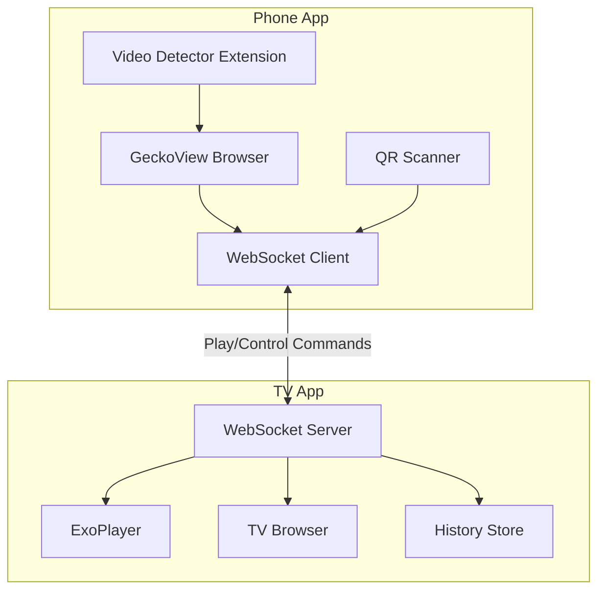

# PlayBridge Architecture Review & Open-Source Recommendations

This document provides a comprehensive architecture review of the PlayBridge project and actionable recommendations before open-sourcing.

---

## Project Overview

**PlayBridge** is a casting solution enabling Android phones to send video URLs and browser control commands to Android TV devices. The project consists of two independent Android applications:

| App | Package | Purpose |
|-----|---------|---------|
| **Phone (Sender)** | `com.playbridge.sender` | GeckoView-based browser with video detection, sends commands to TV |
| **TV (Receiver)** | `com.playbridge.receiver` | WebSocket server + ExoPlayer, receives and plays video streams |

---

## Architecture Diagram



---

## Phone App Architecture

### Package Structure
```
com.playbridge.sender/
├── browser/           # GeckoView browser, video detection, extensions
│   ├── BrowserActivity.kt      (~998 lines - LARGE)
│   ├── Components.kt           (DI container for Gecko components)
│   ├── DetectedVideosSheet.kt
│   ├── VideoDetector.kt
│   └── ...
├── connection/        # WebSocket client
│   ├── WebSocketClient.kt
│   └── ConnectionStore.kt
├── model/             # Protocol messages
│   ├── Message.kt     (serializable data classes)
│   └── TvDevice.kt
└── ui/                # Compose UI screens
    ├── HomeScreen.kt
    ├── QRScannerScreen.kt
    └── theme/
```

### Key Components

| Component | File | Purpose |
|-----------|------|---------|
| Browser Engine | [Components.kt](file:///Users/atulmehla/repos/personal/PlayBridge/phone/app/src/main/java/com/playbridge/sender/browser/Components.kt) | Singleton DI container for GeckoRuntime, BrowserStore, AddonManager |
| Browser UI | [BrowserActivity.kt](file:///Users/atulmehla/repos/personal/PlayBridge/phone/app/src/main/java/com/playbridge/sender/browser/BrowserActivity.kt) | Main browser activity with tab management, extensions |
| WebSocket | [WebSocketClient.kt](file:///Users/atulmehla/repos/personal/PlayBridge/phone/app/src/main/java/com/playbridge/sender/connection/WebSocketClient.kt) | OkHttp-based client with auto-retry (60 attempts, 5s intervals) |
| Video Detection | [background.js](file:///Users/atulmehla/repos/personal/PlayBridge/phone/app/src/main/assets/extensions/video_detector/background.js) | Browser extension detecting video content types |

### Dependencies
- **GeckoView** (Mozilla) - Full Firefox engine
- **Mozilla Android Components** - Tabs, toolbar, extensions support
- **OkHttp** - WebSocket client
- **CameraX + ML Kit** - QR code scanning
- **Jetpack Compose** - UI

---

## TV App Architecture

### Package Structure
```
com.playbridge.receiver/
├── MainActivity.kt            # Navigation + screen state
├── browser/                   # TV WebView browser
│   ├── BrowserActivity.kt
│   └── BrowserScreen.kt
├── data/                      # Persistence
│   └── HistoryStore.kt
├── model/                     # Protocol messages (duplicated from phone)
│   ├── Message.kt
│   └── PairedDevice.kt
├── pairing/                   # QR code display, token management
│   └── PairingStore.kt
├── player/                    # Video playback
│   └── PlayerActivity.kt      (~796 lines)
├── server/                    # WebSocket server
│   ├── ServerService.kt       (foreground service)
│   └── WebSocketServer.kt     (Ktor-based)
└── ui/                        # Compose TV UI screens
    ├── HistoryScreen.kt
    ├── HomeScreen.kt
    ├── PairingScreen.kt
    └── theme/
```

### Key Components

| Component | File | Purpose |
|-----------|------|---------|
| WebSocket Server | [WebSocketServer.kt](file:///Users/atulmehla/repos/personal/PlayBridge/tv/app/src/main/java/com/playbridge/receiver/server/WebSocketServer.kt) | Ktor Netty server on port 8765 |
| Server Service | [ServerService.kt](file:///Users/atulmehla/repos/personal/PlayBridge/tv/app/src/main/java/com/playbridge/receiver/server/ServerService.kt) | Foreground service managing server lifecycle |
| Video Player | [PlayerActivity.kt](file:///Users/atulmehla/repos/personal/PlayBridge/tv/app/src/main/java/com/playbridge/receiver/player/PlayerActivity.kt) | ExoPlayer with HLS/DASH/RTSP support, D-pad controls |
| Command Parser | [Message.kt](file:///Users/atulmehla/repos/personal/PlayBridge/tv/app/src/main/java/com/playbridge/receiver/model/Message.kt) | Sealed class parsing WebSocket JSON messages |

### Dependencies
- **Ktor** (Netty) - WebSocket server
- **Media3 ExoPlayer** - Full streaming suite (HLS, DASH, RTSP)
- **ZXing** - QR code generation
- **Jetpack Compose TV** - TV-optimized UI
- **Coil** - Image loading

---

## Communication Protocol

Commands flow from Phone → TV via WebSocket JSON messages:

```json
// Play video
{"type": "command", "action": "play", "payload": {"url": "...", "title": "...", "headers": {...}}}

// Remote control
{"type": "command", "action": "remote", "payload": {"key": "dpad_up"}}

// Player control
{"type": "command", "action": "control", "payload": {"command": "pause"}}

// Heartbeat
{"type": "ping"} / {"type": "pong"}
```

---

## Issues & Refactoring Recommendations

### 🔴 Critical Issues

#### 1. Duplicated Protocol Code
- **Problem**: `Message.kt` is duplicated between phone and TV with slightly different structures
- **Impact**: Protocol changes require updating both files, risk of desync
- **Recommendation**: Extract a shared `protocol` module
```
PlayBridge/
├── protocol/          # NEW: Shared Kotlin multiplatform module
│   └── src/commonMain/kotlin/
│       └── com/playbridge/protocol/
│           ├── Command.kt
│           ├── Message.kt
│           └── Status.kt
├── phone/
└── tv/
```

#### 2. God Object: BrowserActivity.kt (~998 lines)
- **Problem**: Single file handles tabs, extensions, video detection, context menus, downloads
- **Impact**: Hard to test, maintain, and extend
- **Recommendation**: Split into:
  - `TabManager.kt` - Tab lifecycle
  - `ExtensionManager.kt` - Addon/extension handling  
  - Extract Compose UI to separate `@Composable` files

#### 3. Missing Authentication
- **Problem**: [WebSocketServer.kt:91](file:///Users/atulmehla/repos/personal/PlayBridge/tv/app/src/main/java/com/playbridge/receiver/server/WebSocketServer.kt#L91) has `// TODO: Implement token validation`
- **Impact**: Any device on the network can send commands to the TV
- **Recommendation**: Implement token validation on first message, stored in `PairingStore`

### 🟡 Moderate Issues

#### 4. Unsafe SSL in PlayerActivity
- **Problem**: `getUnsafeOkHttpClient()` trusts all certificates
- **Impact**: Security vulnerability for MITM attacks
- **Recommendation**: Make this optional/configurable with clear warnings

#### 5. Hardcoded Values
- Port `8765` hardcoded in multiple places
- Retry counts (60), delays (5s) embedded in code
- **Recommendation**: Move to a `config` object or DataStore preferences

#### 6. Missing Error Handling in Extensions
- Browser extension silently catches errors in [background.js:76-78](file:///Users/atulmehla/repos/personal/PlayBridge/phone/app/src/main/assets/extensions/video_detector/background.js#L76)
- **Recommendation**: Add proper error logging/reporting

### 🟢 Minor Improvements

#### 7. Components.kt is Not True DI
- Uses lazy singletons, not proper dependency injection
- **Recommendation**: Consider Hilt/Koin for testability, or keep as-is if testing isn't a priority

#### 8. ProGuard Rules Minimal
- Default ProGuard rules may strip needed Kotlin serialization classes
- **Recommendation**: Add rules for kotlinx.serialization, Ktor, etc.

---

## Open-Source Preparation Checklist

### ✅ Already Good
- [x] `.gitignore` excludes `keystore/`, `.idea/`
- [x] GitHub Actions CI exists ([android_build.yml](file:///Users/atulmehla/repos/personal/PlayBridge/.github/workflows/android_build.yml))
- [x] Clean package structure with clear separation
- [x] Well-documented protocol messages with KDoc

### ❌ Missing for Open-Source

#### 1. README.md
Create a comprehensive README with:
- Project description and screenshots
- Architecture overview diagram
- Build instructions for both apps
- How pairing works (QR code flow)
- License information

#### 2. LICENSE File
Choose an appropriate license:
- **MIT** - Most permissive
- **Apache 2.0** - Includes patent grant
- **GPL-3.0** - Copyleft, requires derivative works to be open-source

#### 3. CONTRIBUTING.md
Guidelines for:
- Code style
- Pull request process
- Issue templates

#### 4. Security Considerations Documentation
Document:
- The token authentication gap
- SSL bypass option and when to use it
- Local network assumption

#### 5. Remove/Review Sensitive Data
- Check `local.properties` is gitignored ✅
- Remove any hardcoded API keys or tokens
- Review commit history for accidentally committed secrets

#### 6. Improve .gitignore
Current `.gitignore` is minimal. Add:
```gitignore
# Build outputs
*/build/
*.apk
*.aab

# Local config
local.properties
*.jks
*.keystore

# IDE
.idea/
*.iml
.gradle/
.kotlin/

# OS files
.DS_Store
Thumbs.db
```

#### 7. Build Configuration
- Both apps have `isMinifyEnabled = false` for release
- Consider enabling for production releases with proper ProGuard rules

---

## Suggested Project Structure (Refactored)

```
PlayBridge/
├── README.md                    # NEW
├── LICENSE                      # NEW
├── CONTRIBUTING.md              # NEW
├── .github/
│   ├── workflows/
│   │   └── android_build.yml
│   └── ISSUE_TEMPLATE/          # NEW
├── protocol/                    # NEW: Shared module
│   ├── build.gradle.kts
│   └── src/commonMain/kotlin/
├── phone/
│   ├── app/
│   │   └── src/main/
│   │       ├── java/com/playbridge/sender/
│   │       │   ├── browser/
│   │       │   │   ├── BrowserActivity.kt    (slimmed down)
│   │       │   │   ├── TabManager.kt         # NEW: extracted
│   │       │   │   └── ExtensionManager.kt   # NEW: extracted
│   │       │   └── ...
│   │       └── assets/extensions/
│   └── build.gradle.kts
└── tv/
    ├── app/
    └── build.gradle.kts
```

---

## Priority Recommendations

| Priority | Task | Effort |
|----------|------|--------|
| 🔴 High | Add README.md with build instructions | 1-2 hours |
| 🔴 High | Add LICENSE file | 5 minutes |
| 🔴 High | Implement WebSocket token validation | 2-4 hours |
| 🟡 Medium | Expand .gitignore | 10 minutes |
| 🟡 Medium | Extract shared protocol module | 4-8 hours |
| 🟡 Medium | Split BrowserActivity.kt | 4-8 hours |
| 🟢 Low | Add CONTRIBUTING.md | 30 minutes |
| 🟢 Low | Enable ProGuard for release | 2-4 hours |

---

## Summary

**Strengths:**
- Clean architecture with clear separation between sender/receiver
- Modern tech stack (Compose, Kotlin Serialization, Coroutines)
- Well-designed protocol with extensible command structure
- Good use of sealed classes for type-safe command handling

**Key Actions Before Open-Sourcing:**
1. Add README.md and LICENSE
2. Implement token authentication (security-critical)
3. Expand .gitignore
4. Consider extracting shared protocol module for maintainability

The codebase is in good shape for open-sourcing with relatively minor documentation additions. The authentication TODO should be addressed before public release to prevent unauthorized access on shared networks.
