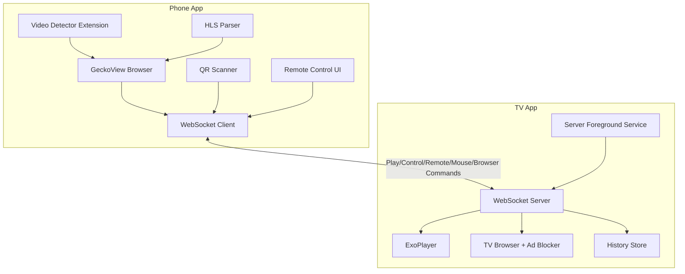

# PlayBridge Architecture Review & Open-Source Recommendations

This document provides a comprehensive architecture review of the PlayBridge project and actionable recommendations before open-sourcing.

---

## Project Overview

**PlayBridge** is a casting solution enabling Android phones to send video URLs and browser control commands to Android TV devices. The project consists of two independent Android applications:

| App | Package | Purpose |
|-----|---------|---------|
| **Phone (Sender)** | `com.playbridge.sender` | GeckoView-based browser with video detection, remote control, sends commands to TV |
| **TV (Receiver)** | `com.playbridge.receiver` | WebSocket server + ExoPlayer + WebView browser, receives and plays video streams |

---

## Architecture Diagram



---

## Phone App Architecture

### Package Structure
```
com.playbridge.sender/
├── browser/           # GeckoView browser, video detection, extensions, remote
│   ├── AddonInstallDialog.kt   (extension install UI)
│   ├── BrowserActivity.kt      (~946 lines - LARGE)
│   ├── BrowserToolbar.kt       (custom toolbar composables)
│   ├── Components.kt           (DI container for Gecko components)
│   ├── DetectedVideosSheet.kt  (bottom sheet for detected videos)
│   ├── ExtensionsScreen.kt     (addon management screen)
│   ├── HlsParser.kt            (HLS stream quality parsing)
│   ├── RemoteControlSheet.kt   (TV remote control UI)
│   ├── TabsScreen.kt           (tab management screen)
│   └── VideoDetector.kt        (video content type detection)
├── connection/        # WebSocket client
│   ├── WebSocketClient.kt
│   └── ConnectionStore.kt
├── model/             # Protocol messages
│   ├── Message.kt     (serializable data classes)
│   └── TvDevice.kt
└── ui/                # Compose UI screens
    ├── HomeScreen.kt
    ├── QRScannerScreen.kt
    └── theme/
```

### Key Components

| Component | File | Purpose |
|-----------|------|---------|
| Browser Engine | [Components.kt](file:///Users/atulmehla/repos/personal/PlayBridge/phone/app/src/main/java/com/playbridge/sender/browser/Components.kt) | Singleton DI container for GeckoRuntime, BrowserStore, AddonManager |
| Browser UI | [BrowserActivity.kt](file:///Users/atulmehla/repos/personal/PlayBridge/phone/app/src/main/java/com/playbridge/sender/browser/BrowserActivity.kt) | Main browser activity with tab management, extensions, context menus |
| Browser Toolbar | [BrowserToolbar.kt](file:///Users/atulmehla/repos/personal/PlayBridge/phone/app/src/main/java/com/playbridge/sender/browser/BrowserToolbar.kt) | Custom Compose toolbar with navigation, URL bar, menu |
| Tab Management | [TabsScreen.kt](file:///Users/atulmehla/repos/personal/PlayBridge/phone/app/src/main/java/com/playbridge/sender/browser/TabsScreen.kt) | Tab list/grid view and management |
| Extension Management | [ExtensionsScreen.kt](file:///Users/atulmehla/repos/personal/PlayBridge/phone/app/src/main/java/com/playbridge/sender/browser/ExtensionsScreen.kt) | Addon installation and management UI |
| Addon Install | [AddonInstallDialog.kt](file:///Users/atulmehla/repos/personal/PlayBridge/phone/app/src/main/java/com/playbridge/sender/browser/AddonInstallDialog.kt) | Extension installation confirmation dialog |
| Remote Control | [RemoteControlSheet.kt](file:///Users/atulmehla/repos/personal/PlayBridge/phone/app/src/main/java/com/playbridge/sender/browser/RemoteControlSheet.kt) | D-pad, touchpad, and player controls for TV |
| HLS Parser | [HlsParser.kt](file:///Users/atulmehla/repos/personal/PlayBridge/phone/app/src/main/java/com/playbridge/sender/browser/HlsParser.kt) | Parses HLS manifests for quality selection |
| WebSocket | [WebSocketClient.kt](file:///Users/atulmehla/repos/personal/PlayBridge/phone/app/src/main/java/com/playbridge/sender/connection/WebSocketClient.kt) | OkHttp-based client with auto-retry (60 attempts, 5s intervals) |
| Video Detection | [background.js](file:///Users/atulmehla/repos/personal/PlayBridge/phone/app/src/main/assets/extensions/video_detector/background.js) | Browser extension detecting video content types |
| Content Script | [content.js](file:///Users/atulmehla/repos/personal/PlayBridge/phone/app/src/main/assets/extensions/video_detector/content.js) | Content script for in-page video detection |
| Find on Page | [FindOnPageBar.kt](file:///Users/atulmehla/repos/personal/PlayBridge/phone/app/src/main/java/com/playbridge/sender/browser/FindOnPageBar.kt) | UI for finding text within web pages |
| Service Discovery | [NsdHelper.kt](file:///Users/atulmehla/repos/personal/PlayBridge/phone/app/src/main/java/com/playbridge/sender/connection/NsdHelper.kt) | Network Service Discovery to find TV services |

### Dependencies
- **GeckoView** (Mozilla) v147 - Full Firefox engine
- **Mozilla Android Components** v147 - Tabs, toolbar, extensions, sessions, prompts support
- **OkHttp** v4.12 - WebSocket client
- **CameraX** v1.4 + **ML Kit Barcode** v17.3 - QR code scanning
- **Jetpack Compose** - UI (Material3)
- **Kotlin Serialization** v1.7 - JSON protocol
- **DataStore** v1.1 - Preferences persistence

---

## TV App Architecture

### Package Structure
```
com.playbridge.receiver/
├── MainActivity.kt            # Navigation + screen state
├── browser/                   # TV WebView browser
│   ├── AdBlocker.kt           (WebView ad blocking with filter lists)
│   └── BrowserActivity.kt    (WebView-based TV browser)
├── data/                      # Persistence
│   └── HistoryStore.kt
├── model/                     # Protocol messages (duplicated from phone)
│   ├── Message.kt             (sealed Command class + parsing)
│   └── PairedDevice.kt
├── pairing/                   # QR code display, token management
│   ├── PairingStore.kt
│   └── QRGenerator.kt         (ZXing QR code bitmap generation)
├── player/                    # Video playback
│   └── PlayerActivity.kt      (~810 lines)
├── server/                    # WebSocket server
│   ├── ServerService.kt       (foreground service, ~317 lines)
│   └── WebSocketServer.kt     (Ktor-based)
└── ui/                        # Compose TV UI screens
    ├── HistoryScreen.kt
    ├── HomeScreen.kt
    ├── PairingScreen.kt
    ├── SettingsScreen.kt
    └── theme/
```

### Key Components

| Component | File | Purpose |
|-----------|------|---------|
| WebSocket Server | [WebSocketServer.kt](file:///Users/atulmehla/repos/personal/PlayBridge/tv/app/src/main/java/com/playbridge/receiver/server/WebSocketServer.kt) | Ktor Netty server on port 8765 |
| Server Service | [ServerService.kt](file:///Users/atulmehla/repos/personal/PlayBridge/tv/app/src/main/java/com/playbridge/receiver/server/ServerService.kt) | Foreground service managing server lifecycle, command routing, context broadcasting |
| Video Player | [PlayerActivity.kt](file:///Users/atulmehla/repos/personal/PlayBridge/tv/app/src/main/java/com/playbridge/receiver/player/PlayerActivity.kt) | ExoPlayer with HLS/DASH/RTSP support, D-pad controls |
| Command Parser | [Message.kt](file:///Users/atulmehla/repos/personal/PlayBridge/tv/app/src/main/java/com/playbridge/receiver/model/Message.kt) | Sealed class parsing WebSocket JSON messages |
| Ad Blocker | [AdBlocker.kt](file:///Users/atulmehla/repos/personal/PlayBridge/tv/app/src/main/java/com/playbridge/receiver/browser/AdBlocker.kt) | WebView request interception with filter list parsing |
| QR Generator | [QRGenerator.kt](file:///Users/atulmehla/repos/personal/PlayBridge/tv/app/src/main/java/com/playbridge/receiver/pairing/QRGenerator.kt) | ZXing-based QR code generation for pairing |
| Settings | [SettingsScreen.kt](file:///Users/atulmehla/repos/personal/PlayBridge/tv/app/src/main/java/com/playbridge/receiver/ui/SettingsScreen.kt) | TV app settings UI |

### Dependencies
- **Ktor** v3.0 (Netty) - WebSocket server
- **Media3 ExoPlayer** v1.5 - Full streaming suite (HLS, DASH, RTSP, Smooth Streaming)
- **ZXing** v3.5 - QR code generation
- **Jetpack Compose TV** - TV-optimized UI (tv-foundation, tv-material)
- **Coil** v3.3 - Image loading (with OkHttp network backend)
- **OkHttp** v4.12 - HTTP client for ExoPlayer data source + URL connections
- **Kotlin Serialization** v1.7 - JSON protocol
- **DataStore** v1.1 - Preferences persistence

---

## Communication Protocol

Commands flow bidirectionally between Phone ↔ TV via WebSocket JSON messages:

### Phone → TV Commands

```json
// Play video
{"type": "command", "action": "play", "payload": {"url": "...", "title": "...", "headers": {...}, "contentType": "..."}}

// Open browser on TV
{"type": "command", "action": "browser", "payload": {"url": "..."}}

// Player control
{"type": "command", "action": "control", "payload": {"command": "pause"}}

// Remote control (D-pad navigation)
{"type": "command", "action": "remote", "payload": {"key": "dpad_up"}}

// Mouse/touchpad control
{"type": "command", "action": "mouse", "payload": {"event": "move", "dx": 10.5, "dy": -3.2}}

// Browser control (refresh, toggle extensions)
{"type": "command", "action": "browser_control", "payload": {"action": "refresh"}}

// Context query (ask TV what screen it's on)
{"type": "command", "action": "context_query"}

// Heartbeat
{"type": "ping"}
```

### TV → Phone Responses

```json
// Playback status
{"type": "status", "state": "playing", "position": 12345, "duration": 60000, "title": "..."}

// Context response
{"type": "context", "active": "player"}  // "player", "browser", or "idle"

// Heartbeat
{"type": "pong"}
```

---

## Issues & Refactoring Recommendations

### 🔴 Critical Issues

#### 1. Duplicated Protocol Code
- **Problem**: `Message.kt` is duplicated between phone and TV. A `protocol` module exists but currently only contains `NsdConstants.kt`.
- **Impact**: Protocol changes require updating both files, risk of desync
- **Recommendation**: Migrate `Message.kt` and `Command` classes to the existing `protocol` shared module.


#### 2. Large File: BrowserActivity.kt (~946 lines)
- **Problem**: Single file handles tabs, extensions, video detection, context menus, downloading, finds on page, toolbar integration
- **Impact**: Hard to test, maintain, and extend
- **Note**: Some extraction has been done (`FindOnPageBar.kt`, `BrowserToolbar.kt`, etc.), but `BrowserActivity.kt` remains large
- **Recommendation**: Further extract tab lifecycle and extension handling logic into manager classes

### 🟡 Moderate Issues

#### 4. Unsafe SSL in PlayerActivity
- **Problem**: `getUnsafeOkHttpClient()` trusts all certificates (line 216)
- **Impact**: Security vulnerability for MITM attacks
- **Recommendation**: Make this optional/configurable with clear warnings

#### 5. Hardcoded Values
- Port `8765` hardcoded in 6 places across both apps
- Retry counts (60), delays (5s) embedded in code
- **Recommendation**: Move to a `config` object or DataStore preferences

#### 6. Missing Error Handling in Extensions
- Browser extension silently catches errors in [background.js:76-89](file:///Users/atulmehla/repos/personal/PlayBridge/phone/app/src/main/assets/extensions/video_detector/background.js#L76) (3 separate silent catches)
- **Recommendation**: Add proper error logging/reporting

### 🟢 Minor Improvements

#### 7. Components.kt is Not True DI
- Uses lazy singletons, not proper dependency injection
- **Recommendation**: Consider Hilt/Koin for testability, or keep as-is if testing isn't a priority

#### 8. ProGuard Rules Minimal
- Default ProGuard rules may strip needed Kotlin serialization classes
- **Recommendation**: Add rules for kotlinx.serialization, Ktor, etc.

---

## Open-Source Preparation Checklist

### ✅ Already Good
- [x] `.gitignore` excludes `.idea`, `keystore/`, `tv/app/release`
- [x] GitHub Actions CI exists ([android_build.yml](file:///Users/atulmehla/repos/personal/PlayBridge/.github/workflows/android_build.yml))
- [x] Clean package structure with clear separation
- [x] Well-documented protocol messages with KDoc
- [x] Sealed class pattern for type-safe command handling (TV side)
- [x] Context-aware remote control (phone queries TV for active screen)
- [x] Authentication implemented (Token/PIN validation)
- [x] README.md created
- [x] LICENSE file added

### ❌ Missing for Open-Source

#### 1. CONTRIBUTING.md
Guidelines for:
- Code style
- Pull request process
- Issue templates

#### 2. Security Considerations Documentation
Document:
- Local network assumption
- SSL bypass option and when to use it

#### 3. Remove/Review Sensitive Data
- Check `local.properties` is gitignored ✅
- Remove any hardcoded API keys or tokens
- Review commit history for accidentally committed secrets

#### 6. Improve .gitignore
Current `.gitignore` is very minimal (only 4 entries). Add:
```gitignore
# Build outputs
*/build/
*.apk
*.aab

# Local config
local.properties
*.jks
*.keystore

# IDE
.idea/
*.iml
.gradle/
.kotlin/

# OS files
.DS_Store
Thumbs.db
```

#### 7. Build Configuration
- Both apps have `isMinifyEnabled = false` for release
- Consider enabling for production releases with proper ProGuard rules

---

## Suggested Project Structure (Refactored)

```
PlayBridge/
├── README.md                    # NEW
├── LICENSE                      # NEW
├── CONTRIBUTING.md              # NEW
├── .github/
│   ├── workflows/
│   │   └── android_build.yml
│   └── ISSUE_TEMPLATE/          # NEW
├── protocol/                    # NEW: Shared module
│   ├── build.gradle.kts
│   └── src/commonMain/kotlin/
├── phone/
│   ├── app/
│   │   └── src/main/
│   │       ├── java/com/playbridge/sender/
│   │       │   ├── browser/
│   │       │   │   ├── BrowserActivity.kt    (slimmed down)
│   │       │   │   ├── BrowserToolbar.kt
│   │       │   │   ├── TabsScreen.kt
│   │       │   │   ├── ExtensionsScreen.kt
│   │       │   │   ├── RemoteControlSheet.kt
│   │       │   │   ├── HlsParser.kt
│   │       │   │   └── ...
│   │       │   └── ...
│   │       └── assets/extensions/
│   └── build.gradle.kts
└── tv/
    ├── app/
    │   └── src/main/
    │       ├── java/com/playbridge/receiver/
    │       │   ├── browser/
    │       │   │   ├── AdBlocker.kt
    │       │   │   └── BrowserActivity.kt
    │       │   ├── pairing/
    │       │   │   ├── PairingStore.kt
    │       │   │   └── QRGenerator.kt
    │       │   ├── ui/
    │       │   │   ├── SettingsScreen.kt
    │       │   │   └── ...
    │       │   └── ...
    └── build.gradle.kts
```

---

## Priority Recommendations

| Priority | Task | Effort |
|----------|------|--------|
| 🔴 High | Add CONTRIBUTING.md | 30 minutes |
| 🟡 Medium | Migrate messages to shared protocol module | 4-8 hours |
| 🟡 Medium | Further slim BrowserActivity.kt | 2-4 hours |
| 🟡 Medium | Expand .gitignore | 10 minutes |
| 🟢 Low | Enable ProGuard for release | 2-4 hours |

---

## Summary

**Strengths:**
- Clean architecture with clear separation between sender/receiver
- Modern tech stack (Compose, Kotlin Serialization, Coroutines, GeckoView v147, Media3 v1.5)
- Well-designed protocol with extensible command structure (play, browser, control, remote, mouse, browser_control, context_query)
- Good use of sealed classes for type-safe command handling
- Feature-rich phone app with remote control, touchpad, HLS quality parsing, extension management, and tab management
- TV app has ad blocking, context broadcasting, settings, and foreground service architecture

**Key Actions Before Open-Sourcing:**
1. Add README.md and LICENSE
2. Implement token authentication (security-critical — constructor already accepts `authToken`)
3. Expand .gitignore
4. Consider extracting shared protocol module for maintainability

The codebase is in good shape for open-sourcing with relatively minor documentation additions. The authentication TODO should be addressed before public release to prevent unauthorized access on shared networks.
