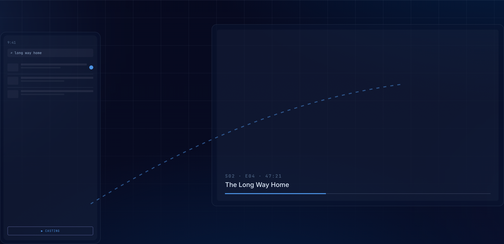
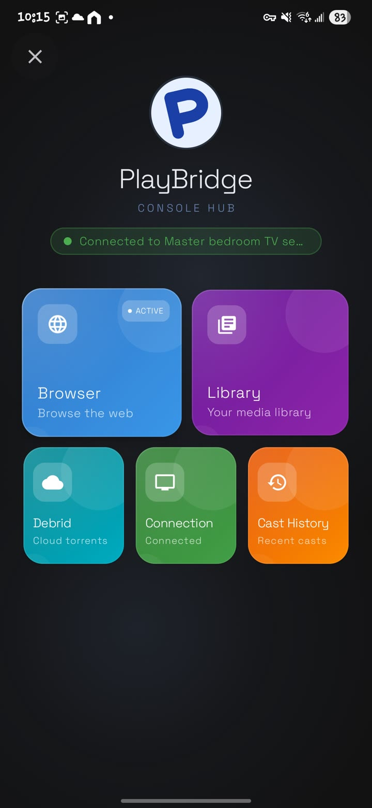
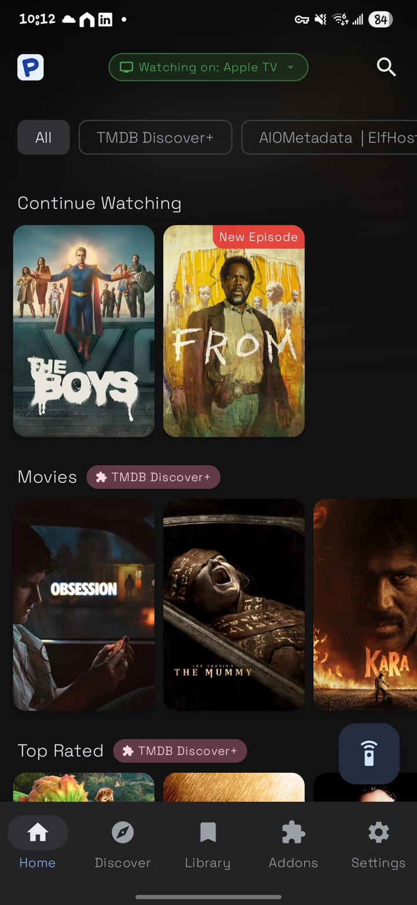
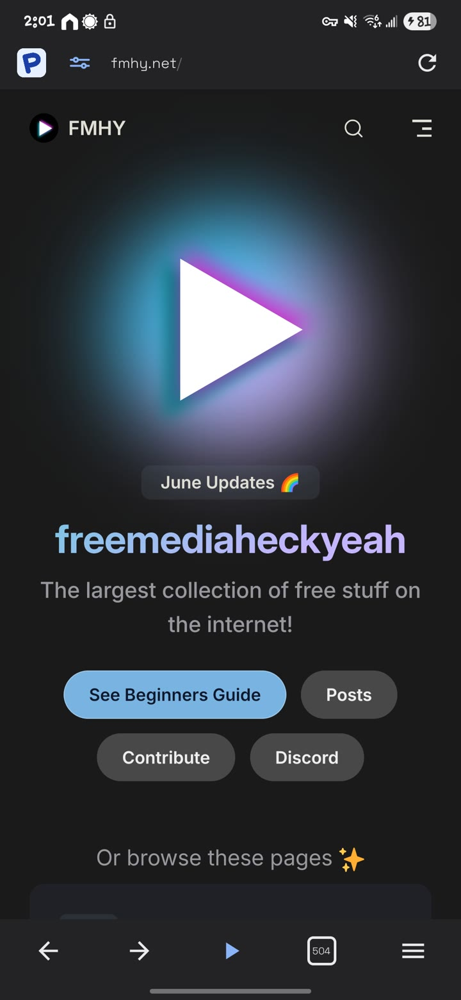
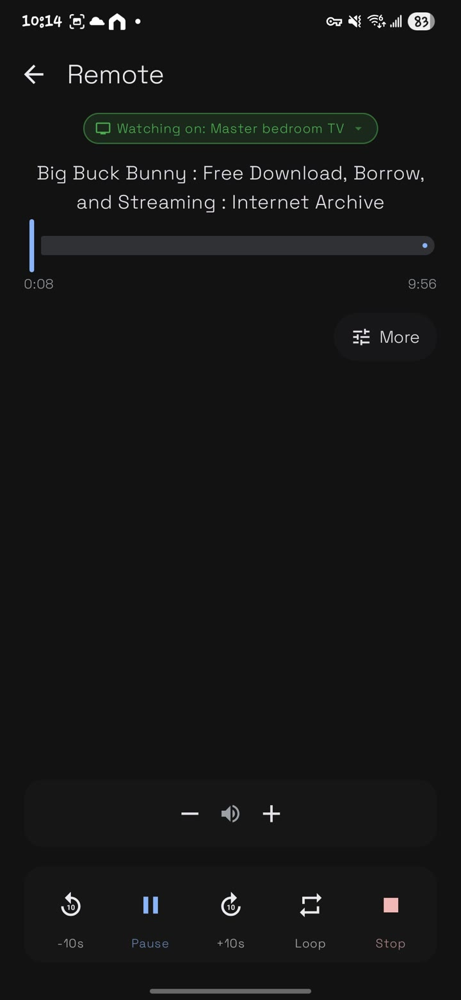
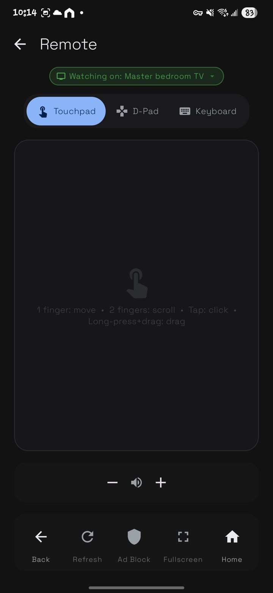

# PlayBridge

<p align="center">
  
  
</p>

<p align="center">
  
</p>

PlayBridge is an open-source Android application suite that bridges the gap between your phone and Android TV. Use PlayBridge to play what you want without the troubles of a clunky TV browser. Find your content on your phone, and seamlessly bridge it to your big screen.

> [!WARNING]
> **PlayBridge is in alpha.** It's under active early development — expect bugs, incomplete features, and breaking changes between releases. Feedback and issue reports are very welcome.

## Screenshots

**Browse & cast from your phone**

| Console hub | Library & discovery | Built-in browser |
|:---:|:---:|:---:|
|  |  |  |

**Your phone is the remote**

| Now playing | Touchpad · D-Pad · Keyboard |
|:---:|:---:|
|  |  |

## Features

- **Send to TV**: Push URLs and content from your phone to your TV.
- **TV Controls**: Use your phone as a remote control for the TV browser and player.
- **Browser**: A fully functional web browser on your phone that syncs with your TV.
- **Open Source**: Built with privacy and transparency in mind.

## Installation & Usage

### 1. Installation
* **Android TV / Fire TV (Receiver):** 
  * Open the **Downloader** app on your TV and enter code `9557748` to download and install the TV Player release directly.
  * Alternatively, download the latest receiver APK from the [Releases](https://github.com/playbridgeapp/playbridge/releases) page and sideload it.
  * *Note:* On first launch, the TV app will request Bluetooth permissions (used for nearby discovery/pairing) and "Display over other apps" (System Alert Window) permissions. These are required for receiver services to run reliably in the background.
* **Android Phone (Sender):** 
  * Download the latest sender APK from the [Releases](https://github.com/playbridgeapp/playbridge/releases) page and install it on your mobile device.

### 2. How to Connect & Cast
1. Connect both your phone and Android TV to the **same local Wi-Fi network**.
2. Open the **PlayBridge** app on your TV. It will display a "Ready to Cast" landing screen.
3. Open the **PlayBridge** app on your phone, and tap the **Cast** icon in the top bar or menu to open the Connection screen.
4. The phone app will scan the network and display your TV. Tap its name to connect.
   * *If the TV is not auto-discovered:* Tap **"Manual Connect"** on the phone and enter the TV's IP address (displayed on the TV's screen).
5. A pairing request will appear on the TV. Select **Allow** using your TV remote.
6. Once connected, browse any video website using the phone app's built-in web browser. Play a video, and tap the cast option when it detects the stream to play it on the TV!

## Components

PlayBridge is a monorepo; each component has its own README:

1.  **[Phone App](mobile/)** (`mobile/`) — the sender: browses the web, detects videos, and controls the TV.
2.  **[TV App](tv/)** (`tv/`) — the receiver for Android TV (plus a tvOS variant): plays content and hosts a web browser.
3.  **[Desktop App](desktop/)** (`desktop/`) — a Flutter desktop receiver that plays casts via libmpv.
4.  **[Browser Extension](extension/)** (`extension/`) — a Firefox extension that casts media from desktop browser tabs.
5.  **[Shared Module](shared/)** (`shared/`) — Kotlin Multiplatform logic, player engines, and protocol bindings.
6.  **[Protocol](protocol/)** (`protocol/`) — protobuf wire-format definitions (git submodule).

## Documentation

Comprehensive project documentation is available:
- **[Design System](DESIGN.md)**: Visual language, color tokens, typography, and component specifications.
- **[Contributing](CONTRIBUTING.md)**: Setup instructions and contribution guidelines.
- **[Security Policy](SECURITY.md)**: Security considerations and vulnerability reporting.

## Build Instructions

### Prerequisites
- Android Studio Ladybug or later
- JDK 17+
- Android SDK 26+

### Building

To build the APKs:

```bash
# Build Phone App
cd mobile/android && ./gradlew :app:assembleDebug

# Build TV App
cd tv/android && ./gradlew :player:app:assembleDebug
```

## Contributing

Contributions are welcome! Please follow these steps:
1.  Fork the repository.
2.  Create a feature branch.
3.  Commit your changes.
4.  Open a Pull Request.

For detailed instructions, see [CONTRIBUTING.md](CONTRIBUTING.md).

## AI Policy

This project is built with the help of AI-assisted tools. We welcome similar contributions, provided you take full ownership of the code you submit. Every pull request—regardless of the tools used—is subject to the same standard of review and testing.

- **Responsibility**: You must fully understand, test, and be able to explain all parts of your changes.
- **Reviewability**: Keep PRs focused and readable. Avoid large, undocumented dumps of generated code.

## Acknowledgments

PlayBridge was inspired by — and learned from — these excellent open-source projects. Huge thanks to their authors and communities:

- **[Stremio](https://github.com/Stremio/stremio-web)**
- **[Swiftfin](https://github.com/jellyfin/Swiftfin)** and **[Streamyfin](https://github.com/streamyfin/streamyfin)**
- **[NuvioTV](https://github.com/NuvioMedia/NuvioTV)**
- **[AIOStreams](https://github.com/Viren070/AIOStreams)**
- **[VLC for iOS/tvOS](https://github.com/videolan/vlc-ios)**
- **[mpvEx](https://github.com/marlboro-advance/mpvEx)**, **[mpvNova](https://github.com/Laskco/mpvNova)**, and **[Player](https://github.com/moneytoo/Player)**

All trademarks and copyrights belong to their respective owners.

## License

This project is licensed under the **GNU General Public License v3.0** (GPLv3). See the [LICENSE](LICENSE) file for details.

It also bundles third-party software under their own (GPLv3-compatible) licenses — including GeckoView (MPL-2.0), FFmpeg and mpv/libmpv (LGPL/GPL), and uBlock Origin (GPL-3.0). See [THIRD_PARTY_LICENSES.md](THIRD_PARTY_LICENSES.md) for the full list.

## Contact

For questions, feedback, or support, please reach out to us at [playbridgeapp@gmail.com](mailto:playbridgeapp@gmail.com).

For security-related issues, please refer to our [Security Policy](SECURITY.md).
