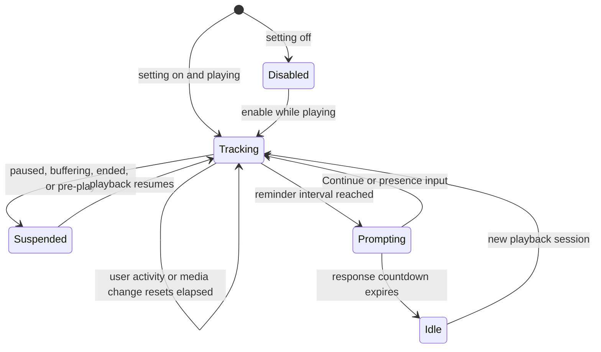

# Design: "Are You Still Watching?" Prompt

| Field | Value |
|---|---|
| **Date** | 2026-07-12 |
| **Status** | Implemented |
| **Scope** | Android TV, Apple TV, and Desktop receivers |
| **Related** | Player controls, receiver settings, playback status |

## Overview

PlayBridge receivers can otherwise keep a cast playing indefinitely. The still-watching feature limits unattended playback by pausing the current media, showing a response countdown, and stopping playback if nobody responds.

The feature is implemented independently in Android TV, Apple TV, and Desktop using the same product policy. It does not require a protocol schema change; existing phone control and remote messages provide presence and stop signals.

## Product policy

- The feature defaults to **Off** on every receiver.
- The reminder interval defaults to **90 minutes**.
- Reminder interval options are **30, 60, 90, 120, 180, and 240 minutes**.
- The response time defaults to **5 minutes**.
- Response-time options are **30 seconds, 1 minute, 2 minutes, 5 minutes, and 10 minutes**.
- Only actively playing time advances the unattended timer. Paused, buffering, stopped, ended, and pre-play states do not advance it.
- Genuine local or phone activity resets elapsed unattended time.
- A new cast, playlist advance, or playlist jump resets elapsed time and dismisses an existing prompt.
- Switching playback engines for the same title preserves the current media session while counting the switch interaction as user presence.

## State and playback behavior

When the reminder interval is reached:

1. Playback pauses immediately.
2. The receiver displays an **Are you still watching?** prompt and starts the configured response countdown.
3. TVs remain awake for the entire response countdown so the prompt stays visible.
4. Continue or another accepted presence input dismisses the prompt, resumes playback, and resets elapsed unattended time.
5. If the countdown expires, playback stops, the player exits, and the receiver returns to its idle context.

The prompt has one visible action: **Continue watching**. There is no redundant Stop button because playback stops automatically when the countdown expires.

## Input behavior

### While tracking

The following user-driven actions reset unattended elapsed time before their normal behavior is applied:

- TV remote and D-pad presses
- Desktop keyboard, mouse, trackpad, and media-key actions
- Phone control and remote commands
- User seeks, track changes, playback-setting changes, playlist interactions, and manual engine switches

Automated progress updates, buffering events, status broadcasts, and automatic segment skipping are not presence signals.

### While the prompt is visible

- Selecting **Continue watching** resumes playback.
- Back, Menu, Escape, Play/Pause, remote navigation, and other presence inputs act as Continue.
- Presence inputs are consumed by the prompt. They do not also seek, pause again, change focus outside the prompt, or exit the player.
- A phone `stop` command remains an explicit stop and exits immediately.
- A platform physical media-stop action may also stop immediately where that action is available.

This Continue-only handling is consistent across Android TV, Apple TV Native/VLC/MPV playback, and Desktop.

## Settings

Each receiver persists these local settings:

| Setting | Default | Options |
|---|---:|---|
| Still Watching Reminder | Off | Off / On |
| Reminder interval | 90 minutes | 30m, 60m, 90m, 120m, 180m, 240m |
| Response time | 5 minutes | 30s, 1m, 2m, 5m, 10m |

Changing a setting takes effect without restarting playback. Turning the feature off dismisses an active prompt, resumes playback, and clears accumulated unattended time.

## Platform implementation

### Android TV

- `StillWatchingController` owns elapsed time, prompting, and response countdown state.
- `PlayerActivity` coordinates engine pause, resume, stop, media changes, settings, and display wake state.
- The still-watching overlay is protected from normal player-control auto-hide behavior.
- Input handling consumes prompt responses before normal D-pad, Back, seek, or playback routing.

### Apple TV

- `StillWatchingController` owns tracking, prompt state, and the response countdown.
- `PlayerView` coordinates all Native, VLC, and MPV engines.
- Playback activity emitted during visual-metadata prebuffering is retained and applied when prebuffering ends.
- Native, VLC, and MPV inputs use Continue-only prompt semantics.
- `UIApplication.shared.isIdleTimerDisabled` remains enabled during playback and during the response countdown, then clears on stop, reset, expiry, or backgrounding as appropriate.

### Desktop

- The still-watching controller coordinates the Flutter player, prompt, countdown, and receiver server state.
- The prompt is rendered above the player using the active application theme.
- Keyboard, pointer, phone, extension bridge, and media-session actions provide presence signals.
- Timeout stops playback and broadcasts idle context to paired senders.

## Media identity and playlists

Every fresh cast is a new media session, even when its URL matches the previous cast. Playlist auto-advance and explicit jumps also reset the timer and dismiss a prompt. Receivers must not allow an old prompt or response countdown to carry into newly selected media.

Engine switches made for the current title should avoid creating a false media change. The switch itself is user activity, so elapsed unattended time resets through the presence path.

## Display and receiver state

TV receivers keep the display awake while the prompt countdown is visible. They release the keep-awake state only after timeout stops playback, an explicit stop, a session reset, or foreground playback otherwise ends.

On timeout, every receiver stops/exits playback and returns to idle. Paired senders must receive the same idle/player-context transition used by an ordinary stop.

## Verification

Expected coverage includes:

- Default-off preference behavior and persistence
- Every reminder and response-time preset, including the 5-minute default and 10-minute option
- Playing-time accumulation and pause/buffering/pre-play suspension
- Immediate pause when prompting begins
- Continue-only UI and Back/Menu/Escape/PlayPause handling
- Explicit phone stop while prompting
- Countdown expiry stopping playback and returning to idle
- User activity resetting elapsed time across local and phone inputs
- Fresh same-URL casts, playlist advances, and playlist jumps resetting state
- TV display wake state throughout the response countdown
- Apple visual-metadata prebuffer transitions for Native, VLC, and MPV
- Desktop paired-sender idle-context synchronization after timeout

Run focused controller tests where available, Desktop Flutter tests and analysis, Android TV unit tests, and an unsigned Apple TV build before merging.
