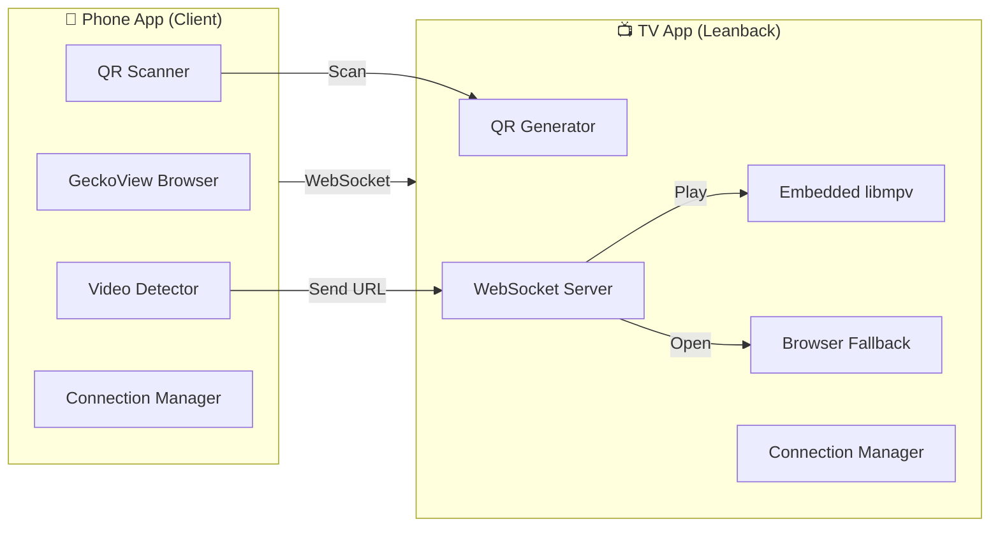
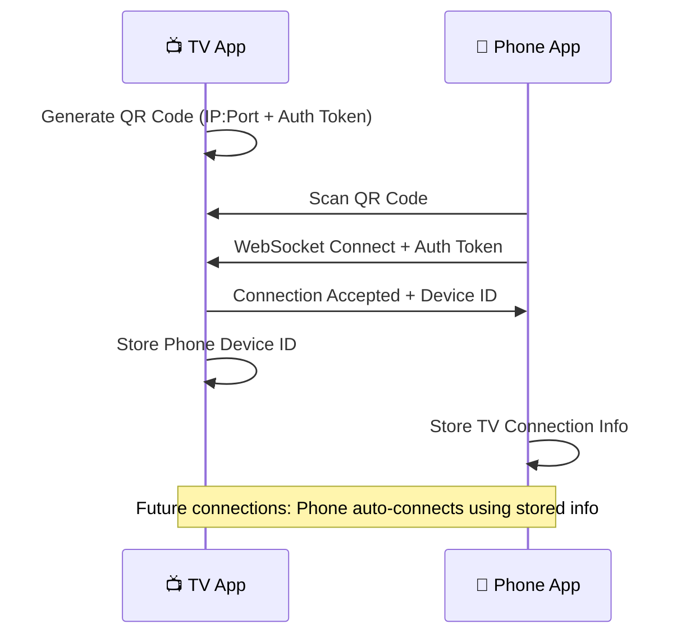
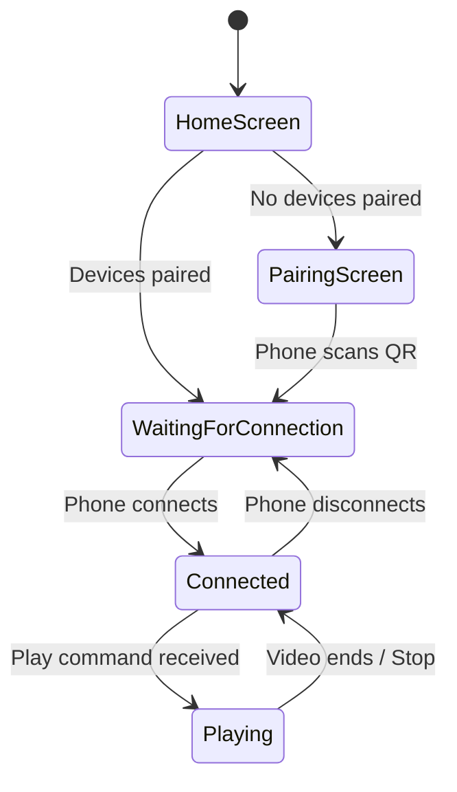
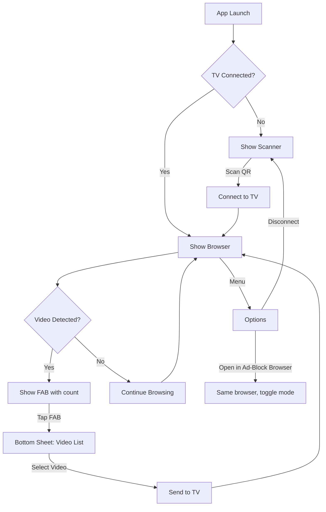
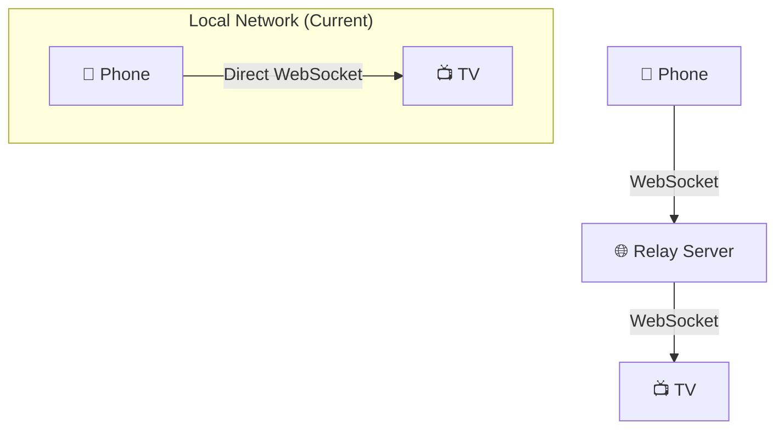

# TV-Phone Video Casting System - Architecture Design

A two-app system for casting video links from a phone to an Android TV, with video source detection capabilities.

---

## Design Decisions

| Decision | Choice | Rationale |
|----------|--------|-----------|
| **MPV Integration** | Embedded library (libmpv) | Keeps playback in-app, avoids killing the app when switching |
| **TV Platform** | Android TV (Leanback) | Optimized for D-pad navigation and TV form factor |
| **Network** | Local network (future: relay server) | WebSocket architecture supports adding relay layer later |
| **GeckoView Size** | Accepted (~50MB) | Required for robust ad-blocking and video detection |

---

## System Overview



---

## Architecture Components

### TV App (Android TV Leanback)

| Component | Technology | Purpose |
|-----------|------------|---------|
| **WebSocket Server** | Ktor Server | Listen for connections from Phone |
| **QR Code Generator** | ZXing | Display pairing QR code with connection info |
| **MPV Player** | libmpv (embedded) | Play video URLs with full codec support |
| **Browser** | WebView | Fallback for non-video URLs |
| **Connection Store** | DataStore | Remember paired devices |
| **Leanback UI** | androidx.leanback | D-pad friendly navigation |

### Phone App (Client/Sender)

| Component | Technology | Purpose |
|-----------|------------|---------|
| **GeckoView Browser** | Mozilla GeckoView | Main browsing with video detection |
| **Video Detector** | WebRequest Interception + JS Injection | Detect video sources (m3u8, mp4, etc.) |
| **QR Scanner** | ML Kit Barcode | Scan TV's QR code for pairing |
| **WebSocket Client** | OkHttp | Send commands to TV |
| **Ad Blocker** | GeckoView Content Blocking API | Block ads in browser |
| **Connection Store** | DataStore | Remember TV connection |

---

## Communication Protocol

### Pairing Flow



### QR Code Data Format

```json
{
  "ip": "192.168.1.100",
  "port": 8765,
  "token": "random-auth-token-uuid",
  "name": "Living Room TV",
  "version": 1
}
```

> [!NOTE]
> For future internet support, add optional `relay` field pointing to relay server URL.

### WebSocket Message Protocol

```json
// Phone → TV: Play in MPV
{
  "type": "command",
  "action": "play",
  "payload": {
    "url": "https://example.com/video.m3u8",
    "title": "Video Title",
    "headers": {"Referer": "https://source.com"}
  }
}

// Phone → TV: Open in Browser
{
  "type": "command",
  "action": "browser",
  "payload": {
    "url": "https://example.com/page"
  }
}

// Phone → TV: Player Controls
{
  "type": "command",
  "action": "control",
  "payload": {"command": "pause"}  // pause, play, seek, stop
}

// TV → Phone: Status Update
{
  "type": "status",
  "state": "playing",
  "position": 120,
  "duration": 3600,
  "title": "Current Video"
}

// Heartbeat
{"type": "ping"} / {"type": "pong"}
```

---

## TV App - Detailed Design

### Project Structure

```
tv-caster/
├── app/
│   ├── src/main/
│   │   ├── java/com/tvcaster/
│   │   │   ├── TvCasterApp.kt            # Application class
│   │   │   ├── MainActivity.kt           # Leanback main activity
│   │   │   ├── server/
│   │   │   │   ├── WebSocketServer.kt    # Ktor WebSocket server
│   │   │   │   ├── ServerService.kt      # Foreground service for server
│   │   │   │   └── MessageHandler.kt     # Process incoming commands
│   │   │   ├── player/
│   │   │   │   ├── PlayerActivity.kt     # Full-screen player (Leanback)
│   │   │   │   ├── MPVLib.kt             # libmpv JNI wrapper
│   │   │   │   └── PlayerControls.kt     # D-pad controls overlay
│   │   │   ├── browser/
│   │   │   │   └── BrowserActivity.kt    # WebView for non-video URLs
│   │   │   ├── pairing/
│   │   │   │   ├── PairingFragment.kt    # Display QR code
│   │   │   │   ├── QRGenerator.kt        # Generate QR bitmap
│   │   │   │   └── PairingStore.kt       # DataStore for paired devices
│   │   │   ├── ui/
│   │   │   │   ├── HomeFragment.kt       # Main Leanback browse fragment
│   │   │   │   ├── StatusFragment.kt     # Show connection status
│   │   │   │   └── SettingsFragment.kt   # Leanback preferences
│   │   │   └── model/
│   │   │       ├── Message.kt            # Protocol data classes
│   │   │       └── PairedDevice.kt       # Stored device info
│   │   ├── jniLibs/                      # libmpv native libraries
│   │   └── res/
│   │       ├── layout/                   # Leanback layouts
│   │       └── drawable/                 # TV-optimized assets
│   └── build.gradle.kts
├── mpv/                                  # libmpv module (native)
└── build.gradle.kts
```

### Key Dependencies

```kotlin
plugins {
    id("com.android.application")
    id("org.jetbrains.kotlin.android")
    id("org.jetbrains.kotlin.plugin.serialization")
}

dependencies {
    // Android TV Leanback
    implementation("androidx.leanback:leanback:1.0.0")
    implementation("androidx.leanback:leanback-preference:1.0.0")
    
    // MPV Player (embedded)
    implementation(project(":mpv"))  // Local libmpv module
    // OR use: implementation("com.github.nicholaschum:mpv-android:...")
    
    // WebSocket Server
    implementation("io.ktor:ktor-server-core:2.3.7")
    implementation("io.ktor:ktor-server-netty:2.3.7")
    implementation("io.ktor:ktor-server-websockets:2.3.7")
    implementation("io.ktor:ktor-serialization-kotlinx-json:2.3.7")
    
    // QR Code Generation
    implementation("com.google.zxing:core:3.5.2")
    
    // JSON Serialization
    implementation("org.jetbrains.kotlinx:kotlinx-serialization-json:1.6.2")
    
    // DataStore
    implementation("androidx.datastore:datastore-preferences:1.0.0")
    
    // Coroutines
    implementation("org.jetbrains.kotlinx:kotlinx-coroutines-android:1.7.3")
}
```

### Leanback UI States



### D-Pad Navigation Map

| Screen | D-Pad Actions |
|--------|---------------|
| **Home** | Up/Down: Navigate rows, Enter: Select |
| **Pairing** | Back: Return home |
| **Player** | Enter: Play/Pause, Left/Right: Seek, Back: Exit |
| **Browser** | Arrow keys: Scroll, Enter: Click, Back: Exit |

---

## Phone App - Detailed Design

### Project Structure

```
phone-caster/
├── app/
│   ├── src/main/
│   │   ├── java/com/phonecaster/
│   │   │   ├── PhoneCasterApp.kt          # Application class
│   │   │   ├── MainActivity.kt            # Main activity with bottom nav
│   │   │   ├── browser/
│   │   │   │   ├── BrowserFragment.kt     # GeckoView browser
│   │   │   │   ├── BrowserToolbar.kt      # URL bar, back/forward
│   │   │   │   ├── VideoDetector.kt       # Intercept video URLs
│   │   │   │   ├── AdBlocker.kt           # Content blocking rules
│   │   │   │   └── GeckoSessionManager.kt # Manage GeckoSessions
│   │   │   ├── detection/
│   │   │   │   ├── DetectedVideo.kt       # Video URL model
│   │   │   │   ├── VideoUrlMatcher.kt     # Pattern matching
│   │   │   │   └── DetectedVideosSheet.kt # Bottom sheet UI
│   │   │   ├── scanner/
│   │   │   │   └── QRScannerFragment.kt   # Camera + ML Kit
│   │   │   ├── connection/
│   │   │   │   ├── WebSocketClient.kt     # OkHttp WebSocket
│   │   │   │   ├── ConnectionManager.kt   # Auto-reconnect logic
│   │   │   │   └── ConnectionStore.kt     # DataStore for TV info
│   │   │   ├── remote/
│   │   │   │   └── RemoteFragment.kt      # Optional: remote control UI
│   │   │   ├── ui/
│   │   │   │   ├── ConnectionStatusView.kt # Floating connection indicator
│   │   │   │   └── VideoFAB.kt            # FAB showing video count
│   │   │   └── model/
│   │   │       ├── Message.kt             # Protocol data classes
│   │   │       └── TvDevice.kt            # Stored TV info
│   │   ├── assets/
│   │   │   └── adblock/                   # EasyList filter rules
│   │   └── res/
│   └── build.gradle.kts
└── build.gradle.kts
```

### Key Dependencies

```kotlin
plugins {
    id("com.android.application")
    id("org.jetbrains.kotlin.android")
    id("org.jetbrains.kotlin.plugin.serialization")
}

dependencies {
    // GeckoView
    implementation("org.mozilla.geckoview:geckoview:121.0.20240107210558")
    
    // WebSocket Client
    implementation("com.squareup.okhttp3:okhttp:4.12.0")
    
    // QR Scanner (ML Kit)
    implementation("com.google.mlkit:barcode-scanning:17.2.0")
    
    // CameraX
    implementation("androidx.camera:camera-camera2:1.3.1")
    implementation("androidx.camera:camera-lifecycle:1.3.1")
    implementation("androidx.camera:camera-view:1.3.1")
    
    // JSON Serialization
    implementation("org.jetbrains.kotlinx:kotlinx-serialization-json:1.6.2")
    
    // DataStore
    implementation("androidx.datastore:datastore-preferences:1.0.0")
    
    // Material Design
    implementation("com.google.android.material:material:1.11.0")
    
    // Navigation
    implementation("androidx.navigation:navigation-fragment-ktx:2.7.6")
    implementation("androidx.navigation:navigation-ui-ktx:2.7.6")
    
    // Coroutines
    implementation("org.jetbrains.kotlinx:kotlinx-coroutines-android:1.7.3")
}
```

### Video Detection Strategy

#### 1. WebRequest Interception (Primary)

```kotlin
class VideoDetector : WebExtension.MessageDelegate {
    private val detectedVideos = mutableStateListOf<DetectedVideo>()
    
    // GeckoView WebExtension intercepts all network requests
    fun onRequest(request: WebRequest): Boolean {
        val url = request.uri
        if (VideoUrlMatcher.isVideoUrl(url)) {
            detectedVideos.add(DetectedVideo(
                url = url,
                referer = request.referrerUri,
                contentType = request.headers["Content-Type"],
                timestamp = System.currentTimeMillis()
            ))
            notifyVideoDetected()
        }
        return false // Don't block the request
    }
}
```

#### 2. JavaScript Injection (Fallback for embedded players)

```javascript
// web_extension/content.js - Injected into all pages
(function() {
    const foundVideos = new Set();
    
    function scanForVideos() {
        document.querySelectorAll('video, source, iframe').forEach(el => {
            const src = el.src || el.currentSrc || el.getAttribute('data-src');
            if (src && !foundVideos.has(src)) {
                foundVideos.add(src);
                browser.runtime.sendMessage({
                    type: 'video_found',
                    url: src,
                    pageUrl: location.href
                });
            }
        });
    }
    
    // Initial scan
    scanForVideos();
    
    // Watch for dynamic content
    new MutationObserver(scanForVideos).observe(document.body, {
        childList: true,
        subtree: true
    });
})();
```

#### 3. URL Pattern Matching

```kotlin
object VideoUrlMatcher {
    private val patterns = listOf(
        // HLS
        Regex(".*\\.m3u8(\\?.*)?$", RegexOption.IGNORE_CASE),
        // MP4/MKV/WebM
        Regex(".*\\.(mp4|mkv|webm|avi|mov)(\\?.*)?$", RegexOption.IGNORE_CASE),
        // DASH
        Regex(".*\\.mpd(\\?.*)?$", RegexOption.IGNORE_CASE),
        Regex(".*/manifest(\\.mpd)?.*", RegexOption.IGNORE_CASE),
        // Known video CDNs
        Regex(".*googlevideo\\.com/videoplayback.*"),
        Regex(".*akamaihd\\.net.*\\.m3u8.*"),
        Regex(".*cloudfront\\.net.*\\.(m3u8|mp4).*"),
    )
    
    fun isVideoUrl(url: String): Boolean = patterns.any { it.matches(url) }
    
    fun detectVideoType(url: String): VideoType = when {
        url.contains(".m3u8") -> VideoType.HLS
        url.contains(".mpd") -> VideoType.DASH
        url.contains(".mp4") -> VideoType.MP4
        else -> VideoType.UNKNOWN
    }
}
```

### Phone App UI Flow



### Bottom Navigation

| Tab | Purpose |
|-----|---------|
| **Browse** | GeckoView browser with video detection |
| **Remote** | Control TV playback (play/pause/seek) |
| **Settings** | Manage connections, ad-block rules |

---

## Future: Internet Relay Support

When adding relay server support, the architecture changes minimally:



### Changes Required

1. **Relay Server**: Simple Node.js/Ktor WebSocket relay
2. **QR Code**: Include relay URL when not on same network
3. **Connection Logic**: Try direct first, fall back to relay
4. **Authentication**: JWT tokens for relay security

---

## Implementation Phases

### Phase 1: Core Infrastructure (Week 1-2)
- [x] ~~Clarify requirements with user~~
- [ ] Set up TV app project (Leanback template)
- [ ] Set up Phone app project
- [ ] Implement WebSocket server (TV) with Ktor
- [ ] Implement WebSocket client (Phone) with OkHttp
- [ ] QR code generation (TV) and scanning (Phone)
- [ ] Basic pairing flow with token validation

### Phase 2: TV App Player (Week 2-3)
- [ ] Integrate libmpv as embedded module
- [ ] Create PlayerActivity with D-pad controls
- [ ] Handle play/pause/seek commands from WebSocket
- [ ] Implement browser fallback (WebView)
- [ ] Add Leanback home screen with connection status

### Phase 3: Phone App Browser (Week 3-4)
- [ ] Set up GeckoView with basic browsing
- [ ] Implement Content Blocking API for ads
- [ ] Create WebExtension for request interception
- [ ] Add JavaScript injection fallback
- [ ] Build detected videos UI (FAB + BottomSheet)

### Phase 4: Integration & Polish (Week 4-5)
- [ ] Send detected videos to TV (with headers/referer)
- [ ] Add connection status indicators
- [ ] Implement auto-reconnection logic
- [ ] History of sent videos
- [ ] Settings screens for both apps

---

## Verification Plan

### Manual Testing Checklist

| Test Case | TV App | Phone App | Expected Result |
|-----------|--------|-----------|-----------------|
| Fresh install | Shows QR | Shows scanner | Pairing works |
| App restart | Auto-connects | Auto-connects | Connection persists |
| Send m3u8 URL | - | Detect + send | MPV plays HLS |
| Send mp4 URL | - | Detect + send | MPV plays MP4 |
| Send web page | - | Menu → browser | WebView opens |
| D-pad controls | Play/Pause | - | Player responds |
| Ad-heavy site | - | Browse | Ads blocked |
| Network change | Shows QR | Reconnect | Re-pairs if needed |

### Test Sites for Video Detection

- https://test-streams.mux.dev/x36xhzz/x36xhzz.m3u8 (HLS test)
- Any YouTube embed page
- Vimeo embeds
- Reddit video posts
