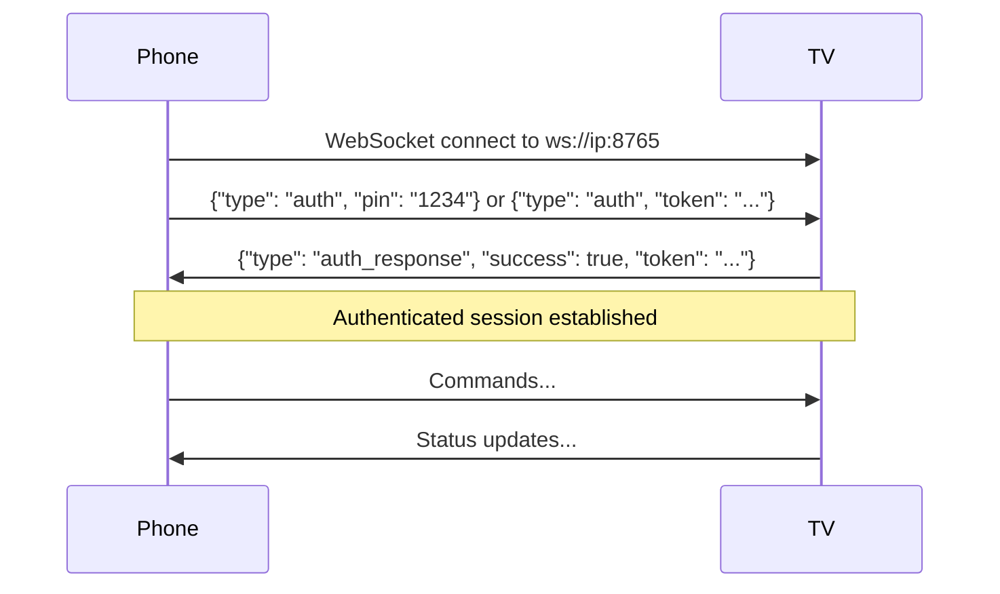

# Protocol Module

The `protocol` module (`com.playbridge.protocol`) is a shared Kotlin JVM library consumed by both apps via `implementation(project(":protocol"))`.

## Package Structure
```
com.playbridge.protocol/
├── BluetoothConstants.kt (Bluetooth RFCOMM service UUID and name)
├── Config.kt             (Shared network configuration variables)
├── Message.kt            (All shared protocol classes, sealed Command class, parseCommand, and helpers)
└── NsdConstants.kt       (NSD service type and key constants)
```

## Key Components

| File | Contents |
|------|----------|
| BluetoothConstants.kt | Bluetooth RFCOMM service UUID and name |
| Config.kt | Shared network configuration variables (e.g., ports, retry delays) |
| Message.kt | All shared protocol classes, sealed `Command` class, `parseCommand()`, and 14 helper functions |
| NsdConstants.kt | NSD service type and key constants |

**Dependencies:** Kotlin JVM, `kotlinx-serialization-json:1.7.3`

---

## Communication Protocol

Commands flow bidirectionally between Phone ↔ TV via WebSocket JSON messages:

### Connection & Authentication Flow



### Phone → TV Commands

```json
// Play video (with optional headers, content type, and external subtitles)
{"type": "command", "action": "play", "payload": {"url": "...", "title": "...", "headers": {...}, "contentType": "...", "subtitles": ["..."], "playerMode": "vlc", "preferredAudioLanguage": "en"}}

// Send a multi-item playlist (e.g., entire TV season)
{"type": "command", "action": "playlist", "payload": {"items": [{"url": "...", "title": "E01"}, {"url": "...", "title": "E02"}], "startIndex": 0}}

// Queue a single item to the current TV playlist
{"type": "command", "action": "queue_add", "payload": {"item": {"url": "...", "title": "Next Ep"}}}

// Jump to a specific index in the TV's active playlist
{"type": "command", "action": "playlist_jump", "payload": {"index": 5}}

// Open browser on TV
{"type": "command", "action": "browser", "payload": {"url": "...", "desktopMode": true}}

// Player control
{"type": "command", "action": "control", "payload": {"command": "pause"}}

// Remote control (D-pad navigation)
{"type": "command", "action": "remote", "payload": {"key": "dpad_up"}}

// Mouse/touchpad control
{"type": "command", "action": "mouse", "payload": {"event": "move", "dx": 10.5, "dy": -3.2}}

// Browser control (refresh, switch engine, maximize/restore video)
{"type": "command", "action": "browser_control", "payload": {"action": "refresh"}}

// Context query (ask TV what screen it's on)
{"type": "command", "action": "context_query"}

// Request pairing (triggers TV to show PIN)
{"type": "request_pairing"}

// Heartbeat
{"type": "ping"}
```

### TV → Phone Responses

```json
// Authentication response
{"type": "auth_response", "success": true, "token": "generated-token"}

// Playback status
{"type": "status", "state": "playing", "position": 12345, "duration": 60000, "title": "..."}

// Context response
{"type": "context", "active": "player"}  // "player", "browser", or "idle"

// Playlist status update (broadcasts full queue state to phone)
{"type": "playlist_status", "items": [{"index": 0, "title": "E01"}], "currentIndex": 0, "totalCount": 1}

// Heartbeat
{"type": "pong"}
```
